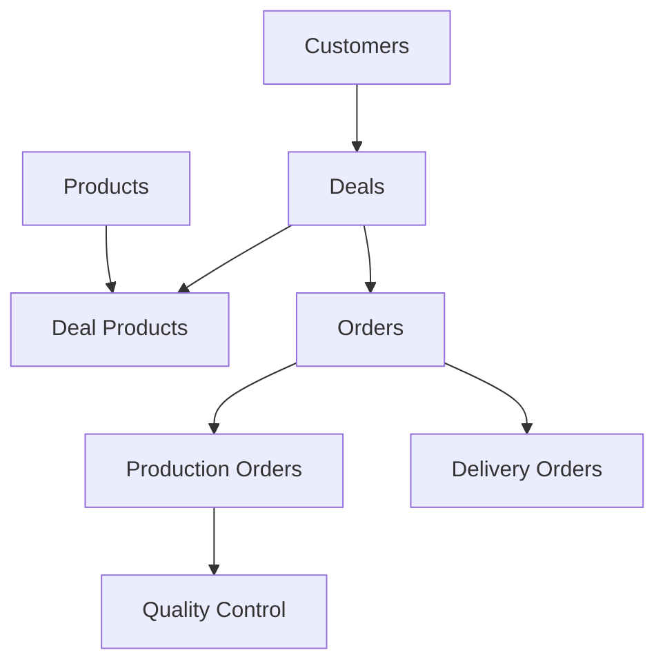

# 📚 Prometric ERP - Sales Modules Documentation

## 🎯 Полная техническая документация модулей продаж

Эта документация содержит детальный анализ всех модулей продаж системы Prometric ERP, включая архитектуру, бизнес-логику, API endpoints, связи между модулями и интеграции.

## 📂 Структура документации

### 📦 [/sales-modules](./sales-modules/README.md)
Детальная документация каждого модуля продаж:
- **[Products Module](./sales-modules/products/README.md)** - Управление продуктами, материалами и услугами
- **[Customers Module](./sales-modules/customers/README.md)** - CRM функционал, управление клиентами
- **[Deals Module](./sales-modules/deals/README.md)** - Управление сделками и pipeline
- **[Orders Module](./sales-modules/orders/README.md)** - Обработка заказов и fulfillment

### 🏗️ [/architecture](./architecture/README.md)
Архитектурные решения и паттерны:
- Event-Driven Architecture
- Domain-Driven Design
- Microservices patterns
- Database design patterns

### 🔗 [/integrations](./integrations/README.md)
Интеграции между модулями:
- Sales-Production интеграция
- Customer-Deal-Order flow
- Event orchestration
- WebSocket real-time updates

### 📡 [/api-reference](./api-reference/README.md)
Полный API Reference:
- REST endpoints
- Request/Response schemas
- Authentication & Authorization
- Error handling

### 💼 [/business-logic](./business-logic/README.md)
Бизнес-процессы и workflows:
- Customer lifecycle
- Deal pipeline stages
- Order fulfillment process
- Production triggers

### 🗄️ [/database-schemas](./database-schemas/README.md)
Схемы базы данных:
- Entity Relationship Diagrams
- Indexes и оптимизации
- Migrations
- Data transformers

## 🚀 Quick Start

### Основные модули и их взаимосвязи

## 🔑 Ключевые особенности системы

1. **Multi-tenancy** - полная изоляция данных через workspaceId + organizationId
2. **Event-Driven Architecture** - асинхронная обработка через EventEmitter2
3. **Lazy Loading** - оптимизация производительности для связанных данных
4. **Comprehensive Audit Trail** - полное логирование всех изменений
5. **Redis Caching** - кеширование для высокой производительности
6. **TypeORM Transactions** - надежность операций с БД
7. **Kazakhstan Localization** - поддержка ИИН/БИН, местных платежных систем

## 📊 Статистика системы

- **4 основных модуля продаж**
- **45+ entities** 
- **100+ API endpoints**
- **15+ orchestrators**
- **50+ event handlers**
- **20+ интеграций между модулями**

## 🛠️ Технологический стек

- **Backend:** NestJS 10.x, TypeScript 5.x
- **Database:** PostgreSQL 14 (AWS RDS)
- **Cache:** Redis
- **Queue:** Bull (Redis-based)
- **Real-time:** WebSockets (Socket.io)
- **File Storage:** AWS S3
- **Search:** Elasticsearch (optional)

## 📝 Версионирование

- **Версия документации:** 1.0.0
- **Дата создания:** 2025-08-23
- **Автор:** Prometric Development Team
- **Последнее обновление:** 2025-08-23

## ⚠️ Важные замечания

1. Все финансовые операции обрабатываются внутренними модулями
2. Внешние банковские интеграции не используются
3. Платежи принимаются через внутреннюю систему
4. Все расчеты ведутся в KZT (тенге)

---

© 2025 Prometric ERP. All rights reserved.