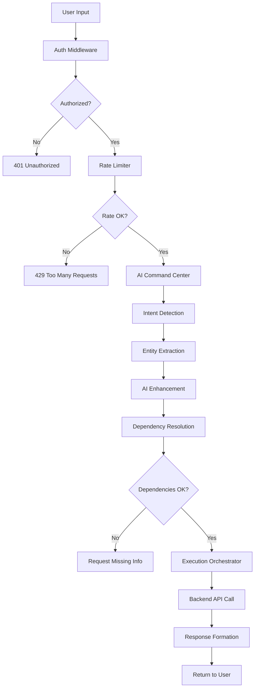

# Prometric AI Service - Детальная Документация

## 📚 Оглавление
1. [Обзор](#обзор)
2. [Архитектура](#архитектура)
3. [Основные Компоненты](#основные-компоненты)
4. [API Endpoints](#api-endpoints)
5. [Поток Обработки Запросов](#поток-обработки-запросов)
6. [Интеграция с Vertex AI](#интеграция-с-vertex-ai)
7. [Обработка Естественного Языка](#обработка-естественного-языка)

## 🎯 Обзор

Prometric AI Service - это интеллектуальный сервис обработки естественного языка, который позволяет пользователям взаимодействовать с системой Prometric через русскоязычные команды.

### Ключевые возможности:
- 🗣️ Обработка команд на русском языке
- 🤖 Интеграция с Google Vertex AI (Gemini)
- 🔄 Автоматическое выполнение бизнес-операций
- 📊 Интеллектуальная аналитика
- 🔗 Полная интеграция с Prometric Backend

## 🏗️ Архитектура

### Технологический стек:
- **Runtime:** Node.js v18+
- **Framework:** Express.js
- **AI Provider:** Google Vertex AI (Gemini 1.5 Flash)
- **Language:** JavaScript (ES6+)
- **Auth:** JWT Bearer tokens
- **HTTP Client:** Axios

### Структура проекта:
```
prometric-ai-service/
├── server.js                    # Главный файл сервера
├── package.json                 # Зависимости
├── config/
│   └── vertex-ai.json          # Конфигурация Vertex AI
├── core/
│   ├── engines/
│   │   ├── ai-command-center.js       # Центр обработки команд
│   │   ├── dependency-resolver.js     # Разрешение зависимостей
│   │   ├── execution-orchestrator.js  # Оркестратор выполнения
│   │   └── workflow-engine.js         # Движок workflow
│   ├── services/
│   │   ├── ai-service.js             # Основной AI сервис
│   │   ├── vertexai-service.js       # Интеграция с Vertex AI
│   │   └── cache-service.js          # Кэширование
│   └── utils/
│       ├── logger.js                  # Логирование
│       └── validators.js             # Валидаторы
├── handlers/
│   └── prometric-backend-handlers.js  # Обработчики backend
├── middleware/
│   ├── auth.js                       # JWT авторизация
│   ├── error-handler.js              # Обработка ошибок
│   └── rate-limiter.js               # Rate limiting
└── routes/
    └── ai-routes.js                  # API маршруты
```

## 🧩 Основные Компоненты

### 1. AI Command Center (`ai-command-center.js`)

Центральный компонент обработки команд:

```javascript
class AICommandCenter {
  constructor() {
    this.intents = new Map();
    this.entityExtractors = new Map();
    this.initializeIntents();
    this.initializeExtractors();
  }

  async processCommand(input, context) {
    // 1. Нормализация входа
    const normalizedInput = this.normalizeInput(input);
    
    // 2. Определение намерения
    const intent = await this.detectIntent(normalizedInput);
    
    // 3. Извлечение сущностей
    const entities = await this.extractEntities(normalizedInput, intent);
    
    // 4. Улучшение через AI
    const enhanced = await this.enhanceWithAI(intent, entities);
    
    // 5. Разрешение зависимостей
    const dependencies = await this.resolveDependencies(intent, entities);
    
    // 6. Выполнение
    const result = await this.execute(intent, entities, dependencies);
    
    return result;
  }
}
```

### 2. Intent Detection Engine

Определение намерений пользователя:

```javascript
detectIntent(input) {
  const intents = {
    // CRUD операции с клиентами
    CREATE_CUSTOMER: /создай?\s+клиента|добавь?\s+клиента|новый\s+клиент/i,
    UPDATE_CUSTOMER: /обнови\s+клиента|измени\s+клиента/i,
    DELETE_CUSTOMER: /удали\s+клиента/i,
    GET_CUSTOMERS: /покажи\s+клиент|список\s+клиент|все\s+клиент/i,
    
    // CRUD операции со сделками
    CREATE_DEAL: /создай?\s+сделку|добавь?\s+сделку|новая\s+сделка/i,
    UPDATE_DEAL: /обнови\s+сделку|измени\s+сделку/i,
    GET_DEALS: /покажи\s+сделк|список\s+сделок|все\s+сделки/i,
    
    // Продукты
    CREATE_PRODUCT: /создай?\s+продукт|добавь?\s+товар/i,
    
    // Задачи
    CREATE_TASK: /создай?\s+задачу|добавь?\s+задачу/i,
    
    // Аналитика
    GET_ANALYTICS: /покажи\s+статистику|аналитика|отчет/i,
    
    // Поиск
    SEARCH: /найди|поиск/i
  };
  
  for (const [intent, pattern] of Object.entries(intents)) {
    if (pattern.test(input)) {
      return intent;
    }
  }
  
  return 'UNKNOWN';
}
```

### 3. Entity Extraction Engine

Извлечение сущностей из текста:

```javascript
extractEntities(input, intent) {
  const entities = {};
  
  // Извлечение имен (русский + английский)
  const namePatterns = [
    /клиента\s+([A-Za-z0-9\s\u0400-\u04FF]+?)(?:\s+с\s|\s+и\s|$|\s*,)/i,
    /клиента\s+"([^"]+)"/i,
    /клиента\s+'([^']+)'/i,
    /компани[яию]\s+([A-Za-z0-9\s\u0400-\u04FF]+?)(?:\s|$)/i
  ];
  
  for (const pattern of namePatterns) {
    const match = input.match(pattern);
    if (match) {
      entities.customer = { name: match[1].trim() };
      break;
    }
  }
  
  // Извлечение email
  const emailMatch = input.match(/[a-zA-Z0-9._%+-]+@[a-zA-Z0-9.-]+\.[a-zA-Z]{2,}/);
  if (emailMatch) {
    entities.email = emailMatch[0];
  }
  
  // Извлечение телефона
  const phoneMatch = input.match(/(?:\+7|8)?[\s-]?\(?\d{3}\)?[\s-]?\d{3}[\s-]?\d{2}[\s-]?\d{2}/);
  if (phoneMatch) {
    entities.phone = phoneMatch[0].replace(/[\s()-]/g, '');
  }
  
  // Извлечение суммы
  const amountMatch = input.match(/(\d{1,3}(?:[\s,]\d{3})*(?:\.\d+)?)\s*(?:тенге|тг|kzt)?/i);
  if (amountMatch) {
    entities.amount = parseFloat(amountMatch[1].replace(/[\s,]/g, ''));
  }
  
  // Извлечение дат
  const datePatterns = [
    /(\d{1,2})[.\/-](\d{1,2})[.\/-](\d{2,4})/,
    /(завтра|послезавтра|сегодня)/i,
    /через\s+(\d+)\s+(день|дня|дней|неделю|недели|месяц)/i
  ];
  
  for (const pattern of datePatterns) {
    const match = input.match(pattern);
    if (match) {
      entities.date = this.parseDate(match[0]);
      break;
    }
  }
  
  return entities;
}
```

### 4. Dependency Resolution Engine

Разрешение зависимостей между операциями:

```javascript
class DependencyResolver {
  async resolveDependencies(intent, entities, context) {
    const dependencies = {};
    
    switch (intent) {
      case 'CREATE_DEAL':
        // Для создания сделки нужен клиент
        if (!entities.customer) {
          dependencies.CUSTOMER = {
            type: 'CUSTOMER',
            status: 'missing',
            suggestions: ['Укажите имя клиента или компании']
          };
        }
        break;
        
      case 'CREATE_INVOICE':
        // Для счета нужен клиент и возможно сделка
        if (!entities.customer) {
          dependencies.CUSTOMER = {
            type: 'CUSTOMER',
            status: 'missing'
          };
        }
        if (!entities.deal) {
          dependencies.DEAL = {
            type: 'DEAL',
            status: 'optional'
          };
        }
        break;
    }
    
    // Всегда нужны workspace и organization
    dependencies.WORKSPACE = {
      type: 'WORKSPACE',
      status: 'resolved',
      data: { id: context.workspaceId }
    };
    
    dependencies.ORGANIZATION = {
      type: 'ORGANIZATION',
      status: 'resolved',
      data: { id: context.organizationId }
    };
    
    return {
      dependencies,
      allSatisfied: !Object.values(dependencies).some(d => d.status === 'missing'),
      missingDependencies: Object.entries(dependencies)
        .filter(([k, v]) => v.status === 'missing')
        .map(([k]) => k)
    };
  }
}
```

### 5. Execution Orchestrator

Оркестратор выполнения операций:

```javascript
class ExecutionOrchestrator {
  constructor(backendHandlers) {
    this.backendHandlers = backendHandlers;
  }
  
  async execute(intent, entities, dependencies, context) {
    try {
      switch (intent) {
        case 'CREATE_CUSTOMER':
          return await this.executeCustomerCreation(entities, context);
          
        case 'CREATE_DEAL':
          return await this.executeDealCreation(entities, context);
          
        case 'GET_CUSTOMERS':
          return await this.executeGetCustomers(entities, context);
          
        case 'GET_ANALYTICS':
          return await this.executeGetAnalytics(entities, context);
          
        default:
          throw new Error(`Unsupported intent: ${intent}`);
      }
    } catch (error) {
      logger.error('Execution failed:', error);
      throw error;
    }
  }
  
  async executeCustomerCreation(entities, context) {
    // Подготовка данных
    const customerData = {
      name: entities.customer?.name || entities.name,
      type: entities.type || 'COMPANY',
      companyName: null,
      email: entities.email || '',
      phone: entities.phone || '',
      status: 'ACTIVE'
    };
    
    // Для типа COMPANY обязательно нужно companyName
    if (customerData.type === 'COMPANY') {
      customerData.companyName = customerData.name;
    }
    
    // Вызов backend
    const result = await this.backendHandlers.createCustomer(customerData, context);
    
    return {
      success: true,
      data: result
    };
  }
}
```

## 📡 API Endpoints

### Основной endpoint: `/api/ai/command`

**Request:**
```http
POST /api/ai/command
Authorization: Bearer {JWT_TOKEN}
Content-Type: application/json

{
  "input": "создай клиента Инновации КЗ с email info@tech.kz",
  "workspaceId": "c5bbd5de-7614-44a0-89fe-973f0555ddc7",
  "organizationId": "7896273a-0458-4276-8248-3e13f1589ac4",
  "userId": "e7b3fa2d-6200-4e6d-97d3-5d7a8df7cbab"
}
```

**Response:**
```json
{
  "success": true,
  "requestId": "req_123456",
  "intent": {
    "action": "CREATE_CUSTOMER",
    "entities": {
      "customer": {"name": "Инновации КЗ"},
      "email": "info@tech.kz"
    },
    "confidence": 0.85
  },
  "result": {
    "success": true,
    "data": {
      "id": "31305023-2b82-4a80-b392-10c328258103",
      "name": "Инновации КЗ",
      "email": "info@tech.kz",
      "type": "COMPANY",
      "createdAt": "2025-08-22T14:00:02.846Z"
    }
  },
  "processingTime": 2456
}
```

### Другие endpoints:

- `/api/ai/chat` - Чат интерфейс
- `/api/ai/analytics` - Аналитика
- `/api/ai/workflow` - Workflow автоматизация
- `/api/ai/batch` - Batch операции
- `/health` - Health check

## 🔄 Поток Обработки Запросов



## 🤖 Интеграция с Vertex AI

### Конфигурация:
```javascript
const vertexAI = new VertexAI({
  project: 'prometric-project',
  location: 'us-central1',
  credentials: require('./config/vertex-ai.json')
});

const model = vertexAI.getGenerativeModel({
  model: 'gemini-1.5-flash',
  generationConfig: {
    maxOutputTokens: 2048,
    temperature: 0.3,
    topP: 0.8,
    topK: 40
  }
});
```

### Использование для улучшения:
```javascript
async enhanceWithAI(intent, entities, input) {
  const prompt = `
    Задача: Улучшить понимание команды пользователя.
    
    Команда: "${input}"
    Определенное намерение: ${intent}
    Извлеченные сущности: ${JSON.stringify(entities)}
    
    Пожалуйста:
    1. Подтверди или исправь намерение
    2. Найди дополнительные сущности
    3. Предложи улучшения запроса
    
    Ответ в JSON формате.
  `;
  
  const result = await model.generateContent(prompt);
  return JSON.parse(result.response.text());
}
```

## 🔐 Безопасность

### JWT Авторизация:
```javascript
// middleware/auth.js
async function authenticateToken(req, res, next) {
  const authHeader = req.headers['authorization'];
  const token = authHeader && authHeader.split(' ')[1];
  
  if (!token) {
    return res.status(401).json({
      success: false,
      error: 'No token provided'
    });
  }
  
  try {
    // Проверка токена через backend
    const response = await axios.get(
      `${BACKEND_URL}/api/v1/auth/verify`,
      { headers: { 'Authorization': `Bearer ${token}` } }
    );
    
    req.user = response.data.user;
    next();
  } catch (error) {
    return res.status(403).json({
      success: false,
      error: 'Invalid token'
    });
  }
}
```

### Rate Limiting:
```javascript
const rateLimiter = rateLimit({
  windowMs: 1 * 60 * 1000, // 1 минута
  max: 60, // 60 запросов в минуту
  burst: 10, // Максимум 10 запросов подряд
  message: 'Слишком много запросов'
});
```

## 📊 Мониторинг и Логирование

### Winston Logger:
```javascript
const logger = winston.createLogger({
  level: 'info',
  format: winston.format.json(),
  transports: [
    new winston.transports.File({ filename: 'error.log', level: 'error' }),
    new winston.transports.File({ filename: 'combined.log' }),
    new winston.transports.Console({
      format: winston.format.simple()
    })
  ]
});
```

### Метрики:
- Время обработки запросов
- Успешность определения намерений
- Точность извлечения сущностей
- Количество API вызовов
- Использование кэша

## 🚀 Оптимизации

### 1. Кэширование:
```javascript
const cache = new NodeCache({ stdTTL: 600 }); // 10 минут

// Кэширование intent detection
const cachedIntent = cache.get(`intent_${normalizedInput}`);
if (cachedIntent) {
  return cachedIntent;
}
```

### 2. Batch Processing:
```javascript
async processBatch(commands) {
  const results = await Promise.all(
    commands.map(cmd => this.processCommand(cmd))
  );
  return results;
}
```

### 3. Connection Pooling:
```javascript
const axiosInstance = axios.create({
  baseURL: BACKEND_URL,
  timeout: 30000,
  httpAgent: new http.Agent({ keepAlive: true }),
  httpsAgent: new https.Agent({ keepAlive: true })
});
```

## 🐛 Отладка

### Debug Mode:
```bash
DEBUG=prometric:* npm start
```

### Логирование запросов:
```javascript
app.use((req, res, next) => {
  logger.info(`${req.method} ${req.path}`, {
    body: req.body,
    headers: req.headers,
    ip: req.ip
  });
  next();
});
```

## 📈 Будущие Улучшения

1. **Voice Commands** - Обработка голосовых команд
2. **Multi-language** - Поддержка казахского и английского
3. **ML Models** - Собственные ML модели для intent detection
4. **Webhooks** - Интеграция с внешними системами
5. **Real-time** - WebSocket для real-time обновлений
6. **Advanced Analytics** - Предиктивная аналитика