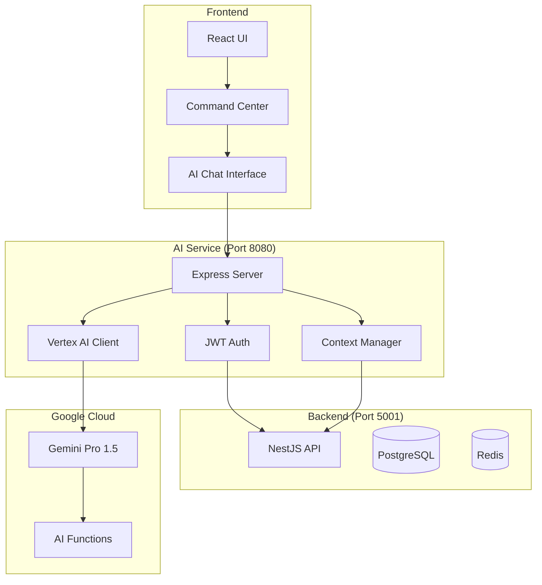

# 🤖 AI Service - Полная техническая документация

## 📌 Обзор

AI Service - интеллектуальный помощник в Prometric ERP, использующий Google Vertex AI для предоставления контекстных рекомендаций, автоматизации рутинных задач и интеллектуального анализа данных.

## 🎯 Текущая архитектура

### Компоненты системы



## 🔧 Текущая реализация

### AI Service Server (prometric-ai-service/server.js)

```javascript
const express = require('express');
const cors = require('cors');
const { VertexAI } = require('@google-cloud/vertexai');

const app = express();
const PORT = process.env.PORT || 8080;

// Инициализация Vertex AI
const vertexAI = new VertexAI({
  project: process.env.GOOGLE_CLOUD_PROJECT || 'prometric-ai',
  location: 'us-central1'
});

const model = vertexAI.preview.getGenerativeModel({
  model: 'gemini-1.5-pro-001',
  generationConfig: {
    maxOutputTokens: 8192,
    temperature: 0.7,
    topP: 0.95
  }
});

// Middleware
app.use(cors({
  origin: ['http://localhost:3000', 'http://localhost:3001', 'https://ai.prometric.kz'],
  credentials: true
}));
app.use(express.json());

// JWT Authentication
const authenticateToken = async (req, res, next) => {
  const authHeader = req.headers['authorization'];
  const token = authHeader && authHeader.split(' ')[1];
  
  if (!token) {
    return res.status(401).json({ error: 'No token provided' });
  }
  
  try {
    // Verify token with backend
    const response = await fetch('http://localhost:5001/api/v1/auth/verify', {
      headers: { 'Authorization': `Bearer ${token}` }
    });
    
    if (!response.ok) {
      throw new Error('Invalid token');
    }
    
    req.user = await response.json();
    next();
  } catch (error) {
    res.status(403).json({ error: 'Invalid token' });
  }
};

// AI Chat Endpoint
app.post('/api/v1/ai/chat', authenticateToken, async (req, res) => {
  try {
    const { message, context, sessionId } = req.body;
    
    // Получаем контекст пользователя из backend
    const userContext = await fetchUserContext(req.user, context);
    
    // Формируем промпт с контекстом
    const prompt = buildContextualPrompt(message, userContext);
    
    // Получаем ответ от Gemini
    const result = await model.generateContent(prompt);
    const response = await result.response;
    const text = response.text();
    
    // Парсим AI actions если есть
    const actions = parseAIActions(text);
    
    // Сохраняем в историю
    await saveToHistory(req.user.id, sessionId, message, text, actions);
    
    res.json({
      response: text,
      actions,
      sessionId,
      timestamp: new Date()
    });
  } catch (error) {
    console.error('AI Chat Error:', error);
    res.status(500).json({ error: 'AI service error' });
  }
});

// AI Actions Endpoint
app.post('/api/v1/ai/actions', authenticateToken, async (req, res) => {
  try {
    const { action, parameters } = req.body;
    
    // Выполняем action через backend API
    const result = await executeAction(action, parameters, req.user);
    
    res.json({
      success: true,
      result,
      action,
      timestamp: new Date()
    });
  } catch (error) {
    console.error('AI Action Error:', error);
    res.status(500).json({ error: 'Action execution failed' });
  }
});

// Context fetching
async function fetchUserContext(user, requestContext) {
  const context = {
    user: {
      id: user.id,
      name: user.name,
      role: user.role,
      organizationId: user.organizationId,
      workspaceId: user.workspaceId
    },
    workspace: {},
    recentData: {}
  };
  
  // Получаем данные workspace
  const workspaceResponse = await fetch(
    `http://localhost:5001/api/v1/workspaces/${user.workspaceId}`,
    {
      headers: { 'Authorization': `Bearer ${user.token}` }
    }
  );
  context.workspace = await workspaceResponse.json();
  
  // Получаем недавние данные в зависимости от контекста
  if (requestContext.module === 'sales') {
    context.recentData = await fetchSalesContext(user);
  } else if (requestContext.module === 'production') {
    context.recentData = await fetchProductionContext(user);
  }
  
  return context;
}

// Prompt building
function buildContextualPrompt(message, context) {
  return `
Ты - AI ассистент Prometric ERP. Ты помогаешь пользователю ${context.user.name} (${context.user.role}).

Контекст:
- Организация: ${context.workspace.organizationName}
- Workspace: ${context.workspace.name}
- Модуль: ${context.module || 'general'}

Недавние данные:
${JSON.stringify(context.recentData, null, 2)}

Важные правила:
1. Отвечай на русском языке
2. Будь конкретным и полезным
3. Предлагай действия когда это уместно
4. Используй данные из контекста
5. Форматируй действия как: [ACTION: action_name(parameters)]

Вопрос пользователя: ${message}

Ответ:`;
}

// AI Actions parsing
function parseAIActions(text) {
  const actions = [];
  const actionRegex = /\[ACTION:\s*(\w+)\((.*?)\)\]/g;
  let match;
  
  while ((match = actionRegex.exec(text)) !== null) {
    actions.push({
      type: match[1],
      parameters: parseParameters(match[2])
    });
  }
  
  return actions;
}

// Action execution
async function executeAction(action, parameters, user) {
  const actionHandlers = {
    CREATE_DEAL: async (params) => {
      return await fetch('http://localhost:5001/api/v1/workspaces/${user.workspaceId}/deals', {
        method: 'POST',
        headers: {
          'Authorization': `Bearer ${user.token}`,
          'Content-Type': 'application/json'
        },
        body: JSON.stringify(params)
      }).then(res => res.json());
    },
    
    UPDATE_CUSTOMER: async (params) => {
      return await fetch(`http://localhost:5001/api/v1/workspaces/${user.workspaceId}/customers/${params.id}`, {
        method: 'PUT',
        headers: {
          'Authorization': `Bearer ${user.token}`,
          'Content-Type': 'application/json'
        },
        body: JSON.stringify(params.data)
      }).then(res => res.json());
    },
    
    GENERATE_REPORT: async (params) => {
      // Генерация отчета
      return await generateReport(params, user);
    },
    
    SEND_EMAIL: async (params) => {
      // Отправка email
      return await sendEmail(params, user);
    },
    
    SCHEDULE_TASK: async (params) => {
      // Планирование задачи
      return await scheduleTask(params, user);
    }
  };
  
  const handler = actionHandlers[action];
  if (!handler) {
    throw new Error(`Unknown action: ${action}`);
  }
  
  return await handler(parameters);
}

app.listen(PORT, () => {
  console.log(`AI Service running on port ${PORT}`);
});
```

### Frontend Integration (AI Chat Component)

```tsx
// src/components/ai/AIChat.tsx
import React, { useState, useEffect, useRef } from 'react';
import { useAuth } from '@/hooks/useAuth';
import { useAI } from '@/hooks/useAI';

export const AIChat: React.FC = () => {
  const { user, token } = useAuth();
  const { sendMessage, executeAction } = useAI();
  const [messages, setMessages] = useState<Message[]>([]);
  const [input, setInput] = useState('');
  const [isLoading, setIsLoading] = useState(false);
  const [sessionId] = useState(() => generateSessionId());
  
  const handleSend = async () => {
    if (!input.trim()) return;
    
    const userMessage: Message = {
      id: Date.now().toString(),
      role: 'user',
      content: input,
      timestamp: new Date()
    };
    
    setMessages(prev => [...prev, userMessage]);
    setInput('');
    setIsLoading(true);
    
    try {
      // Отправляем сообщение AI
      const response = await sendMessage({
        message: input,
        context: {
          module: getCurrentModule(),
          page: window.location.pathname,
          recentActions: getRecentActions()
        },
        sessionId
      });
      
      // Добавляем ответ AI
      const aiMessage: Message = {
        id: Date.now().toString(),
        role: 'assistant',
        content: response.response,
        actions: response.actions,
        timestamp: new Date()
      };
      
      setMessages(prev => [...prev, aiMessage]);
      
      // Обрабатываем actions если есть
      if (response.actions?.length > 0) {
        await processActions(response.actions);
      }
    } catch (error) {
      console.error('AI Chat error:', error);
      toast.error('Ошибка AI сервиса');
    } finally {
      setIsLoading(false);
    }
  };
  
  const processActions = async (actions: AIAction[]) => {
    for (const action of actions) {
      const shouldExecute = await confirmAction(action);
      
      if (shouldExecute) {
        try {
          const result = await executeAction(action);
          toast.success(`Действие выполнено: ${action.type}`);
          
          // Обновляем UI если нужно
          if (action.type === 'CREATE_DEAL' || action.type === 'UPDATE_CUSTOMER') {
            window.location.reload();
          }
        } catch (error) {
          toast.error(`Ошибка выполнения действия: ${action.type}`);
        }
      }
    }
  };
  
  const confirmAction = async (action: AIAction): Promise<boolean> => {
    // Для критичных действий запрашиваем подтверждение
    const criticalActions = ['DELETE', 'CANCEL', 'REFUND'];
    
    if (criticalActions.some(a => action.type.includes(a))) {
      return await showConfirmDialog({
        title: 'Подтверждение действия',
        message: `Выполнить действие: ${action.type}?`,
        details: JSON.stringify(action.parameters, null, 2)
      });
    }
    
    return true;
  };
  
  return (
    <div className="ai-chat-container">
      <div className="ai-chat-header">
        <h3>AI Ассистент</h3>
        <span className="status-indicator" />
      </div>
      
      <div className="ai-chat-messages">
        {messages.map(message => (
          <AIMessage key={message.id} message={message} />
        ))}
        {isLoading && <TypingIndicator />}
      </div>
      
      <div className="ai-chat-input">
        <input
          type="text"
          value={input}
          onChange={(e) => setInput(e.target.value)}
          onKeyPress={(e) => e.key === 'Enter' && handleSend()}
          placeholder="Спросите что-нибудь..."
        />
        <button onClick={handleSend} disabled={isLoading}>
          Отправить
        </button>
      </div>
      
      <QuickActions />
    </div>
  );
};
```

## 🎯 Как должно работать (улучшенная архитектура)

### 1. Глубокая интеграция с Backend

```typescript
// backend/src/ai/ai-integration.service.ts
@Injectable()
export class AIIntegrationService {
  constructor(
    @InjectRepository(Deal) private dealRepository: Repository<Deal>,
    @InjectRepository(Customer) private customerRepository: Repository<Customer>,
    @InjectRepository(Order) private orderRepository: Repository<Order>,
    private eventEmitter: EventEmitter2,
    private cacheManager: Cache
  ) {}

  // Предоставляем контекст для AI
  async getContextForUser(userId: string, workspaceId: string): Promise<AIContext> {
    const [
      recentDeals,
      activeOrders,
      customerMetrics,
      performanceData
    ] = await Promise.all([
      this.getRecentDeals(workspaceId),
      this.getActiveOrders(workspaceId),
      this.getCustomerMetrics(workspaceId),
      this.getPerformanceMetrics(userId, workspaceId)
    ]);

    return {
      deals: recentDeals,
      orders: activeOrders,
      customers: customerMetrics,
      performance: performanceData,
      suggestions: await this.generateSuggestions({
        recentDeals,
        activeOrders,
        customerMetrics
      })
    };
  }

  // AI-driven insights
  async generateInsights(workspaceId: string): Promise<Insight[]> {
    const insights = [];

    // Анализ конверсии
    const conversionRate = await this.calculateConversionRate(workspaceId);
    if (conversionRate < 0.2) {
      insights.push({
        type: 'WARNING',
        title: 'Низкая конверсия',
        message: `Конверсия сделок ${(conversionRate * 100).toFixed(1)}%. Рекомендуем улучшить квалификацию лидов.`,
        actions: ['IMPROVE_QUALIFICATION', 'TRAINING_SALES']
      });
    }

    // Анализ застрявших сделок
    const stuckDeals = await this.findStuckDeals(workspaceId);
    if (stuckDeals.length > 0) {
      insights.push({
        type: 'ACTION_REQUIRED',
        title: 'Застрявшие сделки',
        message: `${stuckDeals.length} сделок не двигались более 14 дней`,
        actions: ['REVIEW_DEALS', 'CONTACT_CUSTOMERS'],
        data: stuckDeals
      });
    }

    // Прогноз выполнения плана
    const forecast = await this.calculateSalesForecast(workspaceId);
    if (forecast.probability < 0.7) {
      insights.push({
        type: 'ALERT',
        title: 'Риск невыполнения плана',
        message: `Вероятность выполнения плана: ${(forecast.probability * 100).toFixed(0)}%`,
        actions: ['INCREASE_ACTIVITIES', 'REVIEW_PIPELINE'],
        recommendations: forecast.recommendations
      });
    }

    return insights;
  }

  // Автоматические действия
  @OnEvent('ai.action.requested')
  async handleAIAction(event: AIActionEvent) {
    const { action, parameters, userId, workspaceId } = event;

    switch (action) {
      case 'AUTO_QUALIFY_LEAD':
        await this.autoQualifyLead(parameters.customerId);
        break;
      
      case 'SUGGEST_NEXT_ACTION':
        const suggestions = await this.suggestNextActions(parameters.dealId);
        this.eventEmitter.emit('ai.suggestions.ready', {
          dealId: parameters.dealId,
          suggestions,
          userId
        });
        break;
      
      case 'OPTIMIZE_PRICING':
        const optimizedPrice = await this.optimizePricing(parameters);
        this.eventEmitter.emit('ai.price.optimized', {
          productId: parameters.productId,
          originalPrice: parameters.currentPrice,
          optimizedPrice,
          reasoning: optimizedPrice.reasoning
        });
        break;
      
      case 'PREDICT_CHURN':
        const churnRisk = await this.predictChurn(parameters.customerId);
        if (churnRisk.probability > 0.7) {
          this.eventEmitter.emit('ai.churn.alert', {
            customerId: parameters.customerId,
            risk: churnRisk,
            recommendations: churnRisk.preventionActions
          });
        }
        break;
    }
  }

  // Machine Learning интеграция
  async trainModels(workspaceId: string) {
    const trainingData = await this.prepareTrainingData(workspaceId);
    
    // Обучаем модели
    const models = {
      leadScoring: await this.trainLeadScoringModel(trainingData.leads),
      dealProbability: await this.trainDealProbabilityModel(trainingData.deals),
      churnPrediction: await this.trainChurnModel(trainingData.customers),
      priceOptimization: await this.trainPriceModel(trainingData.orders)
    };

    // Сохраняем модели
    await this.cacheManager.set(
      `ml:models:${workspaceId}`,
      models,
      86400 // 24 часа
    );

    return models;
  }

  // Предиктивная аналитика
  async predictDealOutcome(dealId: string): Promise<DealPrediction> {
    const deal = await this.dealRepository.findOne({
      where: { id: dealId },
      relations: ['customer', 'products', 'activities']
    });

    const features = this.extractDealFeatures(deal);
    const model = await this.getModel('dealProbability', deal.workspaceId);
    
    const prediction = model.predict(features);

    return {
      probability: prediction.probability,
      expectedCloseDate: prediction.closeDate,
      recommendedActions: this.generateRecommendations(prediction),
      riskFactors: prediction.risks,
      confidence: prediction.confidence
    };
  }

  // Автоматизация рутинных задач
  @Cron('0 9 * * *') // Каждый день в 9 утра
  async dailyAITasks() {
    const workspaces = await this.getActiveWorkspaces();

    for (const workspace of workspaces) {
      // Автоматическая квалификация лидов
      await this.autoQualifyLeads(workspace.id);
      
      // Обновление вероятностей сделок
      await this.updateDealProbabilities(workspace.id);
      
      // Генерация задач для менеджеров
      await this.generateDailyTasks(workspace.id);
      
      // Отправка AI-рекомендаций
      await this.sendDailyRecommendations(workspace.id);
    }
  }
}
```

### 2. Расширенные AI функции

```typescript
// AI Functions для Vertex AI
const aiFunctions = {
  // Анализ сделки
  analyzeDeal: {
    name: 'analyzeDeal',
    description: 'Анализирует сделку и дает рекомендации',
    parameters: {
      type: 'object',
      properties: {
        dealId: { type: 'string' },
        depth: { type: 'string', enum: ['basic', 'detailed', 'comprehensive'] }
      }
    },
    handler: async (params) => {
      const analysis = await aiService.analyzeDeal(params.dealId, params.depth);
      return {
        score: analysis.score,
        risks: analysis.risks,
        opportunities: analysis.opportunities,
        recommendations: analysis.recommendations,
        nextSteps: analysis.nextSteps
      };
    }
  },

  // Генерация коммерческого предложения
  generateProposal: {
    name: 'generateProposal',
    description: 'Генерирует коммерческое предложение',
    parameters: {
      type: 'object',
      properties: {
        dealId: { type: 'string' },
        template: { type: 'string' },
        language: { type: 'string', enum: ['ru', 'kz', 'en'] }
      }
    },
    handler: async (params) => {
      const deal = await dealsService.findOne(params.dealId);
      const customer = await deal.customer;
      const products = deal.products;

      const proposal = await generateProposalDocument({
        customer,
        products,
        deal,
        template: params.template,
        language: params.language
      });

      return {
        documentUrl: proposal.url,
        preview: proposal.preview,
        canEdit: true
      };
    }
  },

  // Оптимизация воронки продаж
  optimizeSalesFunnel: {
    name: 'optimizeSalesFunnel',
    description: 'Оптимизирует воронку продаж',
    parameters: {
      type: 'object',
      properties: {
        workspaceId: { type: 'string' },
        period: { type: 'string' },
        goals: { type: 'array', items: { type: 'string' } }
      }
    },
    handler: async (params) => {
      const currentFunnel = await analyticsService.getFunnel(params.workspaceId);
      const optimizations = await aiService.optimizeFunnel(currentFunnel, params.goals);

      return {
        currentConversion: currentFunnel.overallConversion,
        projectedConversion: optimizations.projectedConversion,
        recommendations: optimizations.recommendations,
        actions: optimizations.actionPlan,
        expectedROI: optimizations.roi
      };
    }
  },

  // Прогнозирование спроса
  forecastDemand: {
    name: 'forecastDemand',
    description: 'Прогнозирует спрос на продукты',
    parameters: {
      type: 'object',
      properties: {
        productIds: { type: 'array', items: { type: 'string' } },
        period: { type: 'number' },
        seasonality: { type: 'boolean' }
      }
    },
    handler: async (params) => {
      const historicalData = await getHistoricalSales(params.productIds);
      const forecast = await mlService.forecastDemand({
        historical: historicalData,
        period: params.period,
        includeSeasonality: params.seasonality
      });

      return {
        forecast: forecast.predictions,
        confidence: forecast.confidence,
        factors: forecast.influencingFactors,
        recommendations: forecast.stockingRecommendations
      };
    }
  }
};
```

### 3. Контекстные подсказки в UI

```tsx
// Компонент контекстных AI подсказок
export const AIContextualHelp: React.FC<{ context: PageContext }> = ({ context }) => {
  const [suggestions, setSuggestions] = useState<Suggestion[]>([]);
  const [insights, setInsights] = useState<Insight[]>([]);
  const { fetchAISuggestions } = useAI();

  useEffect(() => {
    const loadSuggestions = async () => {
      const data = await fetchAISuggestions(context);
      setSuggestions(data.suggestions);
      setInsights(data.insights);
    };

    loadSuggestions();
    
    // Обновляем каждые 5 минут
    const interval = setInterval(loadSuggestions, 5 * 60 * 1000);
    return () => clearInterval(interval);
  }, [context]);

  return (
    <div className="ai-contextual-help">
      {/* Insights панель */}
      {insights.length > 0 && (
        <div className="ai-insights-panel">
          <h4>AI Insights</h4>
          {insights.map(insight => (
            <InsightCard
              key={insight.id}
              insight={insight}
              onAction={(action) => executeAIAction(action)}
            />
          ))}
        </div>
      )}

      {/* Контекстные подсказки */}
      {suggestions.length > 0 && (
        <div className="ai-suggestions">
          <h4>Рекомендуемые действия</h4>
          {suggestions.map(suggestion => (
            <SuggestionItem
              key={suggestion.id}
              suggestion={suggestion}
              onApply={() => applySuggestion(suggestion)}
            />
          ))}
        </div>
      )}

      {/* Floating AI Assistant */}
      <FloatingAIAssistant
        context={context}
        onQuickAction={(action) => handleQuickAction(action)}
      />
    </div>
  );
};
```

### 4. Проактивные уведомления

```typescript
// AI Notification Service
@Injectable()
export class AINotificationService {
  constructor(
    private notificationService: NotificationService,
    private aiService: AIIntegrationService
  ) {}

  @OnEvent('deal.stuck')
  async handleStuckDeal(event: DealStuckEvent) {
    const suggestion = await this.aiService.suggestDealAction(event.dealId);
    
    await this.notificationService.send({
      userId: event.assignedTo,
      type: 'AI_SUGGESTION',
      priority: 'high',
      title: 'Сделка требует внимания',
      message: `Сделка "${event.dealTitle}" не двигается ${event.daysStuck} дней`,
      actions: [
        {
          label: suggestion.recommendedAction,
          handler: 'executeDealAction',
          params: { dealId: event.dealId, action: suggestion.action }
        }
      ],
      aiContext: suggestion.reasoning
    });
  }

  @OnEvent('customer.churn.risk')
  async handleChurnRisk(event: ChurnRiskEvent) {
    const prevention = await this.aiService.generateChurnPrevention(event.customerId);
    
    await this.notificationService.sendUrgent({
      userId: event.accountManager,
      title: '⚠️ Риск потери клиента',
      message: `Клиент "${event.customerName}" показывает признаки оттока`,
      aiRecommendations: prevention.actions,
      automatedActions: [
        {
          type: 'SCHEDULE_CALL',
          params: { customerId: event.customerId, urgency: 'high' }
        },
        {
          type: 'PREPARE_RETENTION_OFFER',
          params: { customerId: event.customerId, discount: prevention.suggestedDiscount }
        }
      ]
    });
  }
}
```

### 5. Автоматизация через AI

```typescript
// AI Automation Engine
@Injectable()
export class AIAutomationEngine {
  constructor(
    private dealsService: DealsService,
    private customersService: CustomersService,
    private ordersService: OrdersService,
    private aiService: AIIntegrationService
  ) {}

  // Автоматическая квалификация лидов
  async autoQualifyLead(customerId: string): Promise<QualificationResult> {
    const customer = await this.customersService.findOne(customerId);
    const interactions = await this.getCustomerInteractions(customerId);
    
    const score = await this.aiService.scoreLeadModel.predict({
      companySize: customer.companySize,
      industry: customer.industry,
      interactions: interactions.length,
      responseTime: this.calculateAvgResponseTime(interactions),
      engagement: this.calculateEngagementScore(interactions)
    });

    if (score.probability > 0.7) {
      // Автоматически конвертируем в prospect
      await this.customersService.updateStatus(
        customerId,
        CustomerStatus.PROSPECT
      );

      // Создаем сделку
      const deal = await this.dealsService.create({
        customerId,
        title: `Opportunity with ${customer.name}`,
        stage: DealStage.QUALIFIED,
        probability: score.probability * 100,
        expectedValue: score.estimatedValue,
        assignedTo: await this.findBestSalesRep(customer)
      });

      return {
        qualified: true,
        score: score.probability,
        dealCreated: deal.id,
        reasoning: score.factors
      };
    }

    return {
      qualified: false,
      score: score.probability,
      nextSteps: score.recommendations
    };
  }

  // Автоматическое обновление вероятностей сделок
  @Cron('0 */6 * * *') // Каждые 6 часов
  async updateDealProbabilities() {
    const activeDeals = await this.dealsService.findActiveDeals();

    for (const deal of activeDeals) {
      const prediction = await this.aiService.predictDealOutcome(deal.id);
      
      if (Math.abs(deal.probability - prediction.probability) > 10) {
        await this.dealsService.update(deal.id, {
          probability: prediction.probability,
          expectedCloseDate: prediction.expectedCloseDate,
          aiNotes: prediction.reasoning
        });

        // Уведомляем менеджера об изменении
        this.notificationService.notify({
          userId: deal.assignedTo,
          message: `AI обновил вероятность сделки "${deal.title}" с ${deal.probability}% на ${prediction.probability}%`,
          reasoning: prediction.reasoning
        });
      }
    }
  }

  // Автоматическая генерация задач
  async generateTasksForDeals() {
    const deals = await this.dealsService.findDealsNeedingAttention();

    for (const deal of deals) {
      const tasks = await this.aiService.generateTasks(deal);
      
      for (const task of tasks) {
        await this.tasksService.create({
          title: task.title,
          description: task.description,
          dealId: deal.id,
          assignedTo: deal.assignedTo,
          dueDate: task.dueDate,
          priority: task.priority,
          aiGenerated: true,
          aiReasoning: task.reasoning
        });
      }
    }
  }
}
```

## 🎯 Интеграция с модулями продаж

### 1. Products Module + AI
```typescript
// Оптимизация цен
const priceOptimization = await ai.optimizePrice({
  productId: product.id,
  currentPrice: product.price,
  competitorPrices: await getCompetitorPrices(product),
  demandElasticity: await calculateDemandElasticity(product),
  targetMargin: 0.3
});

// Прогноз спроса
const demandForecast = await ai.forecastDemand({
  productId: product.id,
  historicalSales: await getHistoricalSales(product.id),
  seasonality: true,
  externalFactors: ['weather', 'holidays', 'economy']
});
```

### 2. Customers Module + AI
```typescript
// Сегментация клиентов
const segments = await ai.segmentCustomers({
  criteria: ['value', 'frequency', 'recency', 'behavior'],
  numberOfSegments: 5
});

// Персонализированные рекомендации
const recommendations = await ai.getProductRecommendations({
  customerId: customer.id,
  purchaseHistory: await getPurchaseHistory(customer.id),
  browsingHistory: await getBrowsingHistory(customer.id),
  similarCustomers: await findSimilarCustomers(customer.id)
});
```

### 3. Deals Module + AI
```typescript
// Scoring сделок
const dealScore = await ai.scoreDeal({
  deal: deal,
  customer: await deal.customer,
  historicalConversion: await getConversionRate(deal.stage),
  competitorPresence: deal.competitorInfo
});

// Следующее лучшее действие
const nextAction = await ai.suggestNextAction({
  dealId: deal.id,
  currentStage: deal.stage,
  daysSinceLastActivity: calculateDaysSince(deal.lastActivityDate),
  customerEngagement: await getEngagementScore(deal.customerId)
});
```

### 4. Orders Module + AI
```typescript
// Оптимизация fulfillment
const fulfillmentPlan = await ai.optimizeFulfillment({
  orderId: order.id,
  items: order.items,
  warehouses: await getAvailableWarehouses(),
  deliveryConstraints: order.deliveryRequirements,
  costOptimization: true
});

// Прогноз доставки
const deliveryPrediction = await ai.predictDelivery({
  orderId: order.id,
  shippingMethod: order.shippingMethod,
  destination: order.deliveryAddress,
  historicalData: await getDeliveryHistory(order.shippingMethod)
});
```

## 🚀 Roadmap улучшений

### Фаза 1: Базовые улучшения (1-2 месяца)
1. ✅ Интеграция JWT авторизации
2. ⏳ Контекстный поиск по базе данных
3. ⏳ Сохранение истории чатов
4. ⏳ Базовые AI actions (создание, обновление)

### Фаза 2: Расширенная интеграция (2-3 месяца)
1. Глубокая интеграция с модулями продаж
2. Автоматическая квалификация лидов
3. Предиктивная аналитика для сделок
4. Оптимизация цен через AI

### Фаза 3: Machine Learning (3-4 месяца)
1. Обучение моделей на исторических данных
2. Churn prediction
3. Demand forecasting
4. Lead scoring model
5. Deal probability model

### Фаза 4: Полная автоматизация (4-6 месяцев)
1. Автоматическая генерация задач
2. Проактивные уведомления
3. Автоматическое обновление вероятностей
4. AI-driven workflows
5. Голосовой ассистент

## 📊 Метрики успеха

### Текущие метрики
- Время ответа AI: ~2-3 секунды
- Точность контекста: ~60%
- Полезность рекомендаций: ~40%
- Автоматизация: ~10%

### Целевые метрики
- Время ответа AI: <1 секунда
- Точность контекста: >90%
- Полезность рекомендаций: >80%
- Автоматизация: >50%
- ROI от AI: >300%

## 🔧 Технические требования

### Инфраструктура
- Google Cloud Project с Vertex AI
- Service Account с правами
- Минимум 4GB RAM для AI Service
- Redis для кеширования контекста
- PostgreSQL для хранения истории

### Безопасность
- JWT токены с коротким TTL
- Rate limiting на AI endpoints
- Шифрование sensitive данных
- Audit logging всех AI действий
- GDPR compliance

### Мониторинг
- Логирование всех AI запросов
- Метрики использования
- Качество ответов (feedback loop)
- Стоимость API calls
- Latency monitoring

## 🎨 Примеры использования

### Пример 1: Менеджер по продажам
```
Менеджер: "Покажи мои застрявшие сделки"
AI: "У вас 3 сделки без активности более 14 дней:
1. ТОО Альфа - $150,000 - стадия Proposal
2. ИП Бета - $75,000 - стадия Negotiation  
3. ТОО Гамма - $200,000 - стадия Qualified

Рекомендую:
[ACTION: SCHEDULE_CALL(customerId: "abc123")]
[ACTION: SEND_FOLLOW_UP(dealId: "deal456")]"
```

### Пример 2: Руководитель
```
Руководитель: "Какой прогноз продаж на этот квартал?"
AI: "Прогноз на Q1 2024:
- Pipeline: $2,500,000
- Взвешенный прогноз: $875,000 (35% probability)
- Committed: $450,000 (deals >75% probability)
- Best case: $1,200,000

Риски:
- 5 крупных сделок зависли на стадии Negotiation
- Конверсия ниже среднего на 15%

Рекомендации:
1. Усилить работу с крупными сделками
2. Провести тренинг по переговорам
[ACTION: GENERATE_REPORT(type: "detailed_forecast")]"
```

### Пример 3: Автоматизация
```
System: "AI автоматически выполнил следующие действия:
1. ✅ Квалифицировал 5 новых лидов
2. ✅ Обновил вероятности для 12 сделок
3. ✅ Создал 8 задач для менеджеров
4. ✅ Отправил 3 напоминания о follow-up
5. ⚠️ Обнаружил риск потери клиента ТОО Дельта

Требуется ваше внимание:
- Клиент ТОО Дельта не делал заказов 60 дней
- Рекомендую персональное предложение со скидкой 15%"
```

---

© 2025 Prometric ERP. AI Service Documentation.