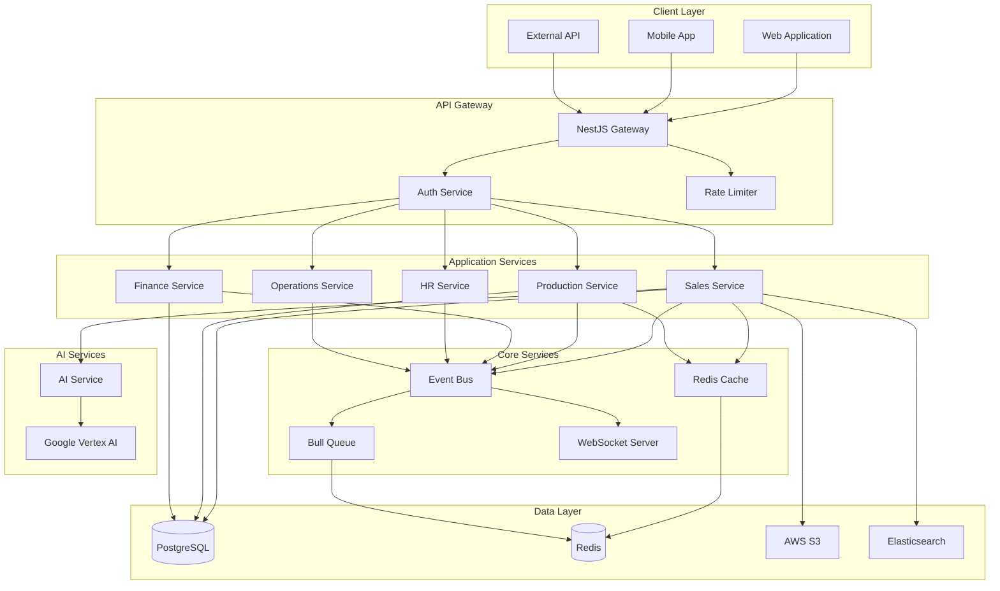

# 🏗️ Architecture Documentation - Prometric ERP

## 📌 Обзор архитектуры

Prometric ERP построен на современной микросервисной архитектуре с использованием Domain-Driven Design (DDD) и Event-Driven Architecture (EDA). Система обеспечивает высокую масштабируемость, надежность и простоту поддержки.

## 🎯 Архитектурные принципы

### 1. Domain-Driven Design (DDD)
```
├── Domain Layer (Entities, Value Objects)
├── Application Layer (Services, Use Cases)
├── Infrastructure Layer (Repositories, External Services)
└── Presentation Layer (Controllers, DTOs)
```

### 2. Event-Driven Architecture
- Асинхронная коммуникация между модулями
- EventEmitter2 для внутренних событий
- Bull Queue для фоновых задач
- WebSockets для real-time обновлений

### 3. CQRS Pattern (частично)
- Разделение команд и запросов
- Оптимизированные read models
- Event sourcing для критичных операций

## 🏛️ Системная архитектура



## 📦 Модульная структура

### Core Modules
```typescript
CoreModule
├── ConfigModule (конфигурация)
├── DatabaseModule (подключение к БД)
├── CacheModule (Redis кеширование)
├── QueueModule (Bull очереди)
├── EventModule (EventEmitter2)
├── LoggerModule (Winston логирование)
└── SecurityModule (безопасность)
```

### Business Modules
```typescript
BusinessModules
├── AuthModule (аутентификация/авторизация)
├── UsersModule (управление пользователями)
├── OrganizationsModule (организации)
├── WorkspacesModule (рабочие пространства)
├── SalesModule
│   ├── ProductsModule
│   ├── CustomersModule
│   ├── DealsModule
│   └── OrdersModule
├── ProductionModule
│   ├── ProductionOrdersModule
│   ├── WorkOrdersModule
│   ├── QualityControlModule
│   └── MaintenanceModule
├── FinanceModule
│   ├── InvoicesModule
│   ├── PaymentsModule
│   ├── ExpensesModule
│   └── ReportsModule
├── HRModule
│   ├── EmployeesModule
│   ├── PayrollModule
│   ├── AttendanceModule
│   └── LeaveModule
└── OperationsModule
    ├── InventoryModule
    ├── WarehouseModule
    ├── LogisticsModule
    └── ProcurementModule
```

## 🔄 Event-Driven Flow

### Event Bus Architecture
```typescript
@Injectable()
export class EventBusService {
  constructor(
    private eventEmitter: EventEmitter2,
    private logger: Logger
  ) {}

  emit<T>(event: string, payload: T): void {
    this.logger.log(`Emitting event: ${event}`);
    this.eventEmitter.emit(event, payload);
  }

  @OnEvent('*')
  handleAllEvents(event: any) {
    // Глобальный обработчик для логирования
    this.logger.debug(`Event received: ${JSON.stringify(event)}`);
  }
}
```

### Orchestration Pattern
```typescript
// Пример: Deal Won Orchestrator
@Injectable()
export class DealWonOrchestrator {
  @OnEvent('deal.won')
  async handleDealWon(event: DealWonEvent) {
    // Координирует создание Order, Invoice, Production Order
    const saga = await this.startSaga(event);
    
    try {
      await this.createOrder(saga);
      await this.createInvoice(saga);
      await this.checkInventory(saga);
      await this.createProductionOrder(saga);
      await this.commitSaga(saga);
    } catch (error) {
      await this.rollbackSaga(saga);
      throw error;
    }
  }
}
```

## 🗄️ Data Architecture

### Database Design Patterns

#### 1. Multi-tenancy через Row-Level Security
```sql
-- Все таблицы имеют
organization_id UUID NOT NULL,
workspace_id UUID NOT NULL,

-- Составной индекс для быстрой фильтрации
INDEX idx_org_workspace (organization_id, workspace_id)
```

#### 2. Soft Deletes
```typescript
@Column({ type: 'timestamp', nullable: true })
deletedAt: Date;

@Column({ nullable: true })
deletedBy: string;
```

#### 3. Audit Trail
```typescript
@CreateDateColumn()
createdAt: Date;

@UpdateDateColumn()
updatedAt: Date;

@Column()
createdBy: string;

@Column({ nullable: true })
updatedBy: string;
```

#### 4. JSONB для гибких структур
```typescript
@Column({ type: 'jsonb', nullable: true })
customFields: Record<string, any>;

@Column({ type: 'jsonb', nullable: true })
metadata: Record<string, any>;
```

### Caching Strategy

#### 1. Cache Layers
```typescript
// L1: Application Memory Cache
private readonly memoryCache = new Map();

// L2: Redis Cache
@Cacheable({ ttl: 300 }) // 5 минут
async findAll(): Promise<Entity[]>

// L3: Database Query Cache
.cache(true, 60000) // TypeORM cache
```

#### 2. Cache Invalidation
```typescript
@CacheEvict({ allEntries: true })
async create(entity: Entity): Promise<Entity>

@CacheEvict({ key: '#id' })
async update(id: string, entity: Entity): Promise<Entity>
```

## 🔐 Security Architecture

### Authentication & Authorization

#### JWT Strategy
```typescript
@Injectable()
export class JwtStrategy extends PassportStrategy(Strategy) {
  constructor(
    private configService: ConfigService,
    private usersService: UsersService
  ) {
    super({
      jwtFromRequest: ExtractJwt.fromAuthHeaderAsBearerToken(),
      secretOrKey: configService.get('JWT_SECRET'),
      ignoreExpiration: false
    });
  }

  async validate(payload: JwtPayload) {
    // Проверка пользователя и workspace
    const user = await this.usersService.findOne(payload.sub);
    if (!user || !user.isActive) {
      throw new UnauthorizedException();
    }
    return user;
  }
}
```

#### Role-Based Access Control (RBAC)
```typescript
@RequirePermissions(Permission.DEALS_CREATE)
@Post()
async create(@Body() dto: CreateDealDto) {
  // Проверка прав происходит в guard
}
```

### Data Protection

#### 1. Encryption at Rest
- PostgreSQL TDE (Transparent Data Encryption)
- S3 Server-Side Encryption

#### 2. Encryption in Transit
- TLS 1.3 для всех соединений
- Certificate pinning для mobile apps

#### 3. Field-Level Encryption
```typescript
@Column({ 
  type: 'text',
  transformer: new EncryptionTransformer()
})
sensitiveData: string;
```

## 🚀 Performance Architecture

### Database Optimization

#### 1. Query Optimization
```typescript
// Использование QueryBuilder для сложных запросов
const deals = await this.dealRepository
  .createQueryBuilder('deal')
  .leftJoinAndSelect('deal.customer', 'customer')
  .leftJoinAndSelect('deal.products', 'products')
  .where('deal.workspaceId = :workspaceId', { workspaceId })
  .andWhere('deal.stage = :stage', { stage: DealStage.WON })
  .orderBy('deal.createdAt', 'DESC')
  .limit(100)
  .cache(true, 60000)
  .getMany();
```

#### 2. Lazy Loading
```typescript
@ManyToOne(() => Customer, { lazy: true })
customer: Promise<Customer>;

// Загружается только при обращении
const customer = await deal.customer;
```

#### 3. Batch Processing
```typescript
async bulkCreate(items: CreateDto[]): Promise<Entity[]> {
  const chunks = chunk(items, 100); // Разбиваем на части
  const results = [];
  
  for (const chunk of chunks) {
    const entities = await this.repository.save(chunk);
    results.push(...entities);
  }
  
  return results;
}
```

### Async Processing

#### 1. Queue Architecture
```typescript
@Processor('orders')
export class OrderProcessor {
  @Process('fulfill')
  async handleFulfillment(job: Job<OrderFulfillmentData>) {
    // Долгая операция в фоне
    await this.fulfillOrder(job.data);
  }
}

// Добавление в очередь
await this.orderQueue.add('fulfill', {
  orderId: order.id,
  priority: order.priority
});
```

#### 2. Event Streaming
```typescript
@WebSocketGateway()
export class RealtimeGateway {
  @SubscribeMessage('subscribe:orders')
  async subscribeToOrders(client: Socket, workspaceId: string) {
    client.join(`workspace:${workspaceId}:orders`);
    
    // Отправляем обновления в реальном времени
    this.eventEmitter.on('order.updated', (order) => {
      if (order.workspaceId === workspaceId) {
        client.emit('order:update', order);
      }
    });
  }
}
```

## 🔄 Integration Patterns

### 1. Adapter Pattern
```typescript
interface IPaymentGateway {
  charge(amount: number, customerId: string): Promise<Payment>;
  refund(paymentId: string, amount: number): Promise<Refund>;
}

@Injectable()
export class KaspiPaymentAdapter implements IPaymentGateway {
  async charge(amount: number, customerId: string): Promise<Payment> {
    // Специфичная для Kaspi логика
  }
}
```

### 2. Repository Pattern
```typescript
@Injectable()
export class DealRepository extends Repository<Deal> {
  async findActiveDeals(workspaceId: string): Promise<Deal[]> {
    return this.find({
      where: {
        workspaceId,
        stage: Not(In([DealStage.WON, DealStage.LOST]))
      }
    });
  }
  
  async getConversionRate(workspaceId: string): Promise<number> {
    // Бизнес-логика в репозитории
  }
}
```

### 3. Factory Pattern
```typescript
@Injectable()
export class OrderFactory {
  createFromDeal(deal: Deal): Order {
    return new Order({
      customerId: deal.customerId,
      items: this.convertDealProducts(deal.products),
      totalAmount: deal.value,
      dealId: deal.id
    });
  }
  
  createFromQuote(quote: Quote): Order {
    // Другая логика создания
  }
}
```

## 🎨 Design Patterns

### 1. Strategy Pattern для расчетов
```typescript
interface IPricingStrategy {
  calculate(items: OrderItem[]): number;
}

class StandardPricingStrategy implements IPricingStrategy {
  calculate(items: OrderItem[]): number {
    return items.reduce((sum, item) => 
      sum + (item.quantity * item.unitPrice), 0
    );
  }
}

class DiscountPricingStrategy implements IPricingStrategy {
  calculate(items: OrderItem[]): number {
    const subtotal = items.reduce((sum, item) => 
      sum + (item.quantity * item.unitPrice), 0
    );
    return subtotal * 0.9; // 10% скидка
  }
}
```

### 2. Observer Pattern через Events
```typescript
@Injectable()
export class InventoryObserver {
  @OnEvent('order.created')
  async handleOrderCreated(event: OrderCreatedEvent) {
    await this.reserveInventory(event.items);
  }
  
  @OnEvent('order.cancelled')
  async handleOrderCancelled(event: OrderCancelledEvent) {
    await this.releaseInventory(event.items);
  }
}
```

### 3. Decorator Pattern для логирования
```typescript
export function LogExecution() {
  return function(
    target: any,
    propertyKey: string,
    descriptor: PropertyDescriptor
  ) {
    const originalMethod = descriptor.value;
    
    descriptor.value = async function(...args: any[]) {
      const start = Date.now();
      const result = await originalMethod.apply(this, args);
      const duration = Date.now() - start;
      
      console.log(`${propertyKey} executed in ${duration}ms`);
      return result;
    };
    
    return descriptor;
  };
}

// Использование
@LogExecution()
async processOrder(orderId: string) {
  // Метод будет автоматически логироваться
}
```

## 🔍 Monitoring & Observability

### 1. Structured Logging
```typescript
@Injectable()
export class AppLogger {
  private logger = winston.createLogger({
    format: winston.format.json(),
    transports: [
      new winston.transports.File({ 
        filename: 'error.log', 
        level: 'error' 
      }),
      new winston.transports.File({ 
        filename: 'combined.log' 
      })
    ]
  });

  log(level: string, message: string, meta?: any) {
    this.logger.log({
      level,
      message,
      timestamp: new Date().toISOString(),
      ...meta
    });
  }
}
```

### 2. Metrics Collection
```typescript
@Injectable()
export class MetricsService {
  private readonly metrics = new Map<string, number>();

  increment(metric: string, value = 1) {
    const current = this.metrics.get(metric) || 0;
    this.metrics.set(metric, current + value);
  }

  @Interval(60000) // Каждую минуту
  async pushMetrics() {
    // Отправка метрик в monitoring system
    for (const [key, value] of this.metrics.entries()) {
      await this.sendToPrometheus(key, value);
    }
    this.metrics.clear();
  }
}
```

### 3. Health Checks
```typescript
@Controller('health')
export class HealthController {
  constructor(
    private health: HealthCheckService,
    private db: TypeOrmHealthIndicator,
    private redis: RedisHealthIndicator
  ) {}

  @Get()
  @HealthCheck()
  check() {
    return this.health.check([
      () => this.db.pingCheck('database'),
      () => this.redis.pingCheck('redis'),
      () => this.checkDiskSpace(),
      () => this.checkMemoryUsage()
    ]);
  }
}
```

## 🚦 Deployment Architecture

### Container Architecture
```yaml
version: '3.8'

services:
  app:
    build: .
    ports:
      - "5001:5001"
    environment:
      - NODE_ENV=production
      - DATABASE_URL=${DATABASE_URL}
      - REDIS_URL=${REDIS_URL}
    depends_on:
      - postgres
      - redis
    deploy:
      replicas: 3
      resources:
        limits:
          cpus: '1'
          memory: 1G
        reservations:
          cpus: '0.5'
          memory: 512M

  postgres:
    image: postgres:14-alpine
    volumes:
      - postgres_data:/var/lib/postgresql/data
    environment:
      - POSTGRES_DB=prometric
      - POSTGRES_USER=admin
      - POSTGRES_PASSWORD=${DB_PASSWORD}

  redis:
    image: redis:7-alpine
    volumes:
      - redis_data:/data
    command: redis-server --appendonly yes

  nginx:
    image: nginx:alpine
    ports:
      - "80:80"
      - "443:443"
    volumes:
      - ./nginx.conf:/etc/nginx/nginx.conf
      - ./ssl:/etc/nginx/ssl
    depends_on:
      - app
```

### Scaling Strategy

#### Horizontal Scaling
- Stateless application servers
- Load balancing через Nginx
- Session storage в Redis
- Shared file storage в S3

#### Vertical Scaling
- Database read replicas
- Connection pooling
- Query optimization
- Index tuning

## 🔧 Development Practices

### Code Organization
```
src/
├── common/           # Shared utilities
├── config/          # Configuration
├── core/            # Core functionality
├── modules/         # Business modules
│   ├── sales/
│   │   ├── controllers/
│   │   ├── services/
│   │   ├── entities/
│   │   ├── dto/
│   │   └── interfaces/
│   └── ...
├── orchestrators/   # Business orchestrators
├── shared/          # Shared modules
└── main.ts         # Entry point
```

### Testing Strategy
```typescript
// Unit Tests
describe('DealsService', () => {
  let service: DealsService;
  
  beforeEach(async () => {
    const module = await Test.createTestingModule({
      providers: [DealsService]
    }).compile();
    
    service = module.get<DealsService>(DealsService);
  });
  
  it('should create a deal', async () => {
    const deal = await service.create(createDealDto);
    expect(deal).toBeDefined();
    expect(deal.stage).toBe(DealStage.LEAD);
  });
});

// Integration Tests
describe('Deal Won Flow', () => {
  it('should create order when deal is won', async () => {
    // Test full orchestration
  });
});

// E2E Tests
describe('Sales Flow (e2e)', () => {
  it('should complete full sales cycle', async () => {
    // Test from API to database
  });
});
```

## 📊 Architecture Decision Records (ADRs)

### ADR-001: Event-Driven Architecture
**Decision**: Use EventEmitter2 for internal events
**Rationale**: Decouples modules, enables async processing
**Consequences**: More complex debugging, eventual consistency

### ADR-002: Multi-tenancy Strategy
**Decision**: Row-level security with organizationId + workspaceId
**Rationale**: Simple implementation, good performance
**Consequences**: Need to ensure all queries include tenant filter

### ADR-003: Caching Strategy
**Decision**: Use Redis for application cache
**Rationale**: Fast, supports complex data structures
**Consequences**: Additional infrastructure component

### ADR-004: No External Bank Integration
**Decision**: All payments handled internally
**Rationale**: Simplified compliance, no external dependencies
**Consequences**: Limited payment options

---

© 2025 Prometric ERP. Architecture Documentation.