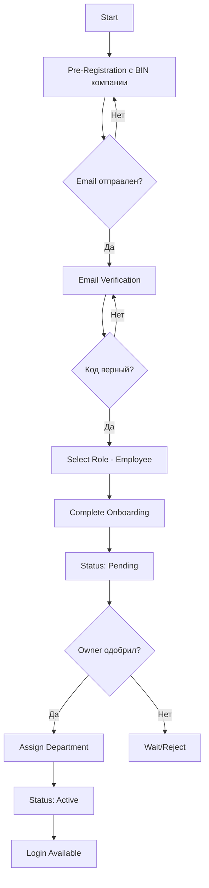

# 👥 Employee Registration Flow

## Обзор

Регистрация сотрудника позволяет присоединиться к существующей организации. Сотрудник проходит процесс регистрации, после чего требуется одобрение от владельца или менеджера организации.

## 📊 Диаграмма процесса



## 🔄 Пошаговый процесс

### Step 1: Pre-Registration с BIN компании

**Endpoint:** `POST /api/v1/auth/registration/pre-register`

**Request Body:**
```json
{
  "email": "employee@example.com",
  "password": "SecurePassword123!",
  "firstName": "Асет",
  "lastName": "Асетов",
  "phone": "+77021234567",
  "companyBin": "123456789012",  // BIN существующей компании
  "role": "USER"
}
```

**Response (Success):**
```json
{
  "success": true,
  "message": "Registration successful. Please check your email for verification code.",
  "email": "employee@example.com",
  "userId": "uuid-here",
  "clearStorage": true
}
```

**Что происходит на backend:**
1. Проверка существующего пользователя
2. Проверка существования компании по BIN
3. Создание user с статусом `pending_verification`
4. Генерация кода верификации
5. Отправка email с кодом

### Step 2: Email Verification

**Endpoint:** `POST /api/v1/auth/registration/verify-email`

**Request Body:**
```json
{
  "email": "employee@example.com",
  "code": "654321"
}
```

**Response (Success):**
```json
{
  "success": true,
  "message": "Email verified successfully",
  "accessToken": "jwt-token-here",
  "refreshToken": "refresh-token-here",
  "user": {
    "id": "uuid",
    "email": "employee@example.com",
    "emailVerified": true,
    "status": "pending_role"
  }
}
```

### Step 3: Select Role (Employee)

**Endpoint:** `POST /api/v1/auth/registration/select-role`

**Headers:**
```
Authorization: Bearer {token-from-step-2}
```

**Request Body:**
```json
{
  "role": "employee",
  "companyBin": "123456789012",
  "position": "Software Developer",
  "departmentPreference": "IT"  // Опционально
}
```

**Response (Success):**
```json
{
  "success": true,
  "message": "Role selected. Awaiting approval from organization owner.",
  "data": {
    "user": {
      "id": "uuid",
      "role": "employee",
      "status": "pending_approval"
    },
    "organizationId": "org-uuid",
    "joinRequest": {
      "id": "request-uuid",
      "status": "pending",
      "requestedAt": "2025-08-18T10:00:00Z"
    }
  }
}
```

**Что происходит на backend:**
1. Обновление роли пользователя на `employee`
2. Поиск организации по BIN
3. Создание записи в `organization_join_requests`
4. Установка статуса `pending_approval`
5. Отправка уведомления владельцу организации

### Step 4: Complete Onboarding (Limited)

**Endpoint:** `POST /api/v1/auth/registration/complete-onboarding`

**Headers:**
```
Authorization: Bearer {token}
```

**Request Body:**
```json
{
  "preferences": {
    "theme": "light",
    "language": "ru",
    "notifications": true,
    "timezone": "Asia/Almaty"
  },
  "profileInfo": {
    "skills": ["JavaScript", "React", "Node.js"],
    "experience": "3 years",
    "education": "Bachelor's in Computer Science"
  }
}
```

**Response (Success):**
```json
{
  "success": true,
  "message": "Onboarding completed. Awaiting approval.",
  "data": {
    "user": {
      "id": "uuid",
      "status": "pending_approval",
      "onboardingCompleted": true
    },
    "nextSteps": "Your request has been sent to the organization administrator. You will receive an email once approved."
  }
}
```

### Step 5: Owner/Manager Approval

**Endpoint:** `POST /api/v1/workspaces/{workspaceId}/employees/{employeeId}/approve`

**Headers:**
```
Authorization: Bearer {owner-token}
```

**Request Body:**
```json
{
  "departmentId": "dept-uuid",
  "position": "Senior Developer",
  "permissions": ["read", "write", "comment"]
}
```

**Response (Success):**
```json
{
  "success": true,
  "message": "Employee approved successfully",
  "data": {
    "employee": {
      "id": "employee-uuid",
      "userId": "user-uuid",
      "status": "active",
      "departmentId": "dept-uuid",
      "position": "Senior Developer",
      "workspaceId": "workspace-uuid",
      "organizationId": "org-uuid"
    }
  }
}
```

**Что происходит на backend:**
1. Обновление статуса employee на `active`
2. Назначение в отдел
3. Установка позиции
4. Создание записи в `workspace_users`
5. Отправка email сотруднику об одобрении
6. Генерация нового токена с полными правами

## 🔐 Состояния сотрудника

| Статус | Описание |
|--------|----------|
| `pending_verification` | Ожидает подтверждения email |
| `email_verified` | Email подтвержден, выбирает роль |
| `pending_approval` | Ожидает одобрения от owner/manager |
| `active` | Одобрен и активен |
| `suspended` | Временно заблокирован |
| `rejected` | Заявка отклонена |

## 🎯 Процесс одобрения (Owner perspective)

### Получение списка pending employees

**Endpoint:** `GET /api/v1/workspaces/{workspaceId}/employee-management/pending-employees`

**Response:**
```json
{
  "success": true,
  "data": [
    {
      "id": "employee-uuid",
      "email": "employee@example.com",
      "firstName": "Асет",
      "lastName": "Асетов",
      "requestedAt": "2025-08-18T10:00:00Z",
      "position": "Software Developer",
      "status": "pending"
    }
  ]
}
```

### Отклонение заявки

**Endpoint:** `POST /api/v1/workspaces/{workspaceId}/employees/{employeeId}/reject`

**Request Body:**
```json
{
  "reason": "Position not available"
}
```

## 🔑 Различия в правах доступа

### Employee (После одобрения)
```json
{
  "permissions": [
    "workspace.read",
    "tasks.create",
    "tasks.update.own",
    "documents.read",
    "documents.create",
    "profile.update.own"
  ]
}
```

### Employee (Pending)
```json
{
  "permissions": [
    "profile.read.own",
    "profile.update.own"
  ]
}
```

## ⚠️ Возможные ошибки

### Pre-Registration
- `400` - BIN компании не найден
- `400` - Email уже зарегистрирован
- `400` - Неверный формат BIN

### Select Role
- `404` - Организация с таким BIN не найдена
- `400` - Организация заблокирована
- `409` - Заявка уже существует

### Approval Process
- `403` - Только owner/manager может одобрять
- `404` - Сотрудник не найден
- `400` - Сотрудник уже одобрен

## 📝 Важные замечания

1. **BIN компании обязателен** - сотрудник должен знать BIN организации
2. **Одобрение обязательно** - без одобрения доступ ограничен
3. **Отдел опционален** - может быть назначен позже
4. **Email уведомления** - отправляются на каждом этапе
5. **Ограниченный доступ** - до одобрения сотрудник не видит данные компании

## 🧪 Тестовые данные

```bash
# Тестовый BIN для существующей организации
TEST_BIN="010203040506"

# Тестовый owner для одобрения
OWNER_EMAIL="jasulan80770@gmail.com"

# Запуск теста
./test-scripts/employee-registration/test-employee-registration.sh
```

## 🔗 Связанные документы

- [API Endpoints](../../api-endpoints/employee-registration/README.md)
- [Test Scripts](../../test-scripts/employee-registration/README.md)
- [Owner Registration](../owner-registration/README.md)
- [Role Management](../role-management/README.md)