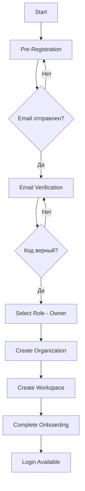

# 👤 Owner Registration Flow

## Обзор

Регистрация владельца организации - это процесс создания новой компании в системе Prometric. Владелец получает полный доступ ко всем функциям системы и может управлять сотрудниками.

## 📊 Диаграмма процесса



## 🔄 Пошаговый процесс


### Step 1: Pre-Registration

**Endpoint:** `POST /api/v1/auth/registration/pre-register`

**Request Body:**
```json
{
  "email": "owner@company.com",
  "password": "SecurePassword123!",
  "firstName": "Иван",
  "lastName": "Иванов",
  "phone": "+77011234567",
  "role": "USER"  // Всегда USER на этом этапе
}
```

**Response (Success):**
```json
{
  "success": true,
  "message": "Registration successful. Please check your email for verification code.",
  "email": "owner@company.com",
  "userId": "uuid-here",
  "clearStorage": true
}
```

**Что происходит на backend:**
1. Проверка существующего пользователя
2. Создание user с статусом `pending_verification`
3. Генерация 6-значного кода верификации
4. Сохранение кода в таблице `email_verifications`
5. Отправка email с кодом (в dev mode код также выводится в логи)

### Step 2: Email Verification

**Endpoint:** `POST /api/v1/auth/registration/verify-email`

**Request Body:**
```json
{
  "email": "owner@company.com",
  "code": "123456"
}
```

**Response (Success):**
```json
{
  "success": true,
  "message": "Email verified successfully",
  "accessToken": "jwt-token-here",
  "refreshToken": "refresh-token-here",
  "user": {
    "id": "uuid",
    "email": "owner@company.com",
    "emailVerified": true,
    "status": "pending_role"
  }
}
```

**Что происходит на backend:**
1. Проверка кода в базе данных
2. Проверка срока действия кода (10 минут)
3. Обновление статуса пользователя на `email_verified`
4. Генерация временного JWT токена
5. Возврат токена для следующих шагов

### Step 3: Select Role (Owner)

**Endpoint:** `POST /api/v1/auth/registration/select-role`

**Headers:**
```
Authorization: Bearer {token-from-step-2}
```

**Request Body:**
```json
{
  "role": "owner",
  "companyName": "ТОО Моя Компания",
  "companyBin": "123456789012",
  "companyAddress": "г. Алматы, ул. Абая 100",
  "companyPhone": "+77011234567"
}
```

**Response (Success):**
```json
{
  "success": true,
  "message": "Role selected successfully",
  "data": {
    "user": {
      "id": "uuid",
      "role": "owner",
      "status": "pending_onboarding"
    },
    "organization": {
      "id": "org-uuid",
      "name": "ТОО Моя Компания",
      "bin": "123456789012"
    },
    "workspace": {
      "id": "workspace-uuid",
      "name": "Main Workspace",
      "type": "main"
    }
  }
}
```

**Что происходит на backend:**
1. Обновление роли пользователя на `owner`
2. Создание новой организации
3. Создание основного workspace
4. Создание записи Employee с ролью owner
5. Связывание user с organization и workspace

### Step 4: Complete Onboarding

**Endpoint:** `POST /api/v1/auth/registration/complete-onboarding`

**Headers:**
```
Authorization: Bearer {token}
```

**Request Body:**
```json
{
  "preferences": {
    "theme": "light",
    "language": "ru",
    "notifications": true,
    "timezone": "Asia/Almaty"
  },
  "organizationSettings": {
    "industry": "IT",
    "employeeCount": "10-50",
    "fiscalYearStart": "01-01"
  }
}
```

**Response (Success):**
```json
{
  "success": true,
  "message": "Onboarding completed successfully",
  "accessToken": "final-jwt-token",
  "refreshToken": "refresh-token",
  "user": {
    "id": "uuid",
    "email": "owner@company.com",
    "role": "owner",
    "status": "active",
    "onboardingCompleted": true,
    "organizationId": "org-uuid",
    "workspaceId": "workspace-uuid"
  }
}
```

**Что происходит на backend:**
1. Сохранение пользовательских настроек
2. Обновление настроек организации
3. Установка статуса `active`
4. Установка флага `onboardingCompleted = true`
5. Генерация финального JWT токена
6. Создание refresh token

## 🔐 Состояния пользователя

| Статус | Описание |
|--------|----------|
| `pending_verification` | Пользователь создан, ожидает верификации email |
| `email_verified` | Email подтвержден, ожидает выбора роли |
| `pending_onboarding` | Роль выбрана, ожидает завершения onboarding |
| `active` | Полностью активный пользователь |
| `suspended` | Аккаунт временно заблокирован |
| `deleted` | Аккаунт удален |

## 🔑 Структура JWT токена для Owner

```json
{
  "email": "owner@company.com",
  "sub": "user-uuid",
  "role": "owner",
  "registrationStatus": "active",
  "status": "active",
  "organizationId": "org-uuid",
  "workspaceId": "workspace-uuid",
  "employeeId": "employee-uuid",
  "onboardingCompleted": true,
  "permissions": [
    "organization.manage",
    "employees.manage",
    "workspace.manage",
    "billing.manage",
    "settings.manage"
  ],
  "iat": 1234567890,
  "exp": 1234567890,
  "iss": "prometric-api"
}
```

## ⚠️ Возможные ошибки

### Pre-Registration
- `400` - Email уже существует
- `400` - Неверный формат email
- `400` - Слабый пароль
- `429` - Слишком много попыток регистрации

### Email Verification
- `400` - Неверный код
- `400` - Код истек
- `404` - Пользователь не найден
- `429` - Слишком много попыток

### Select Role
- `401` - Недействительный токен
- `400` - BIN уже зарегистрирован
- `400` - Недопустимая роль
- `400` - Отсутствуют обязательные поля для owner

### Complete Onboarding
- `401` - Недействительный токен
- `400` - Onboarding уже завершен
- `400` - Неверные настройки

## 🧪 Тестовый скрипт

```bash
# Запуск полного flow регистрации owner
./test-scripts/owner-registration/test-owner-registration.sh
```

## 📝 Примечания

1. **BIN validation**: БИН компании должен быть 12 цифр
2. **Password requirements**: Минимум 8 символов, 1 заглавная, 1 цифра, 1 спецсимвол
3. **Email verification**: Код действителен 10 минут
4. **Token lifetime**: Временный токен - 1 час, финальный - 6 часов
5. **Workspace creation**: Автоматически создается основной workspace при регистрации owner

## 🔗 Связанные документы

- [API Endpoints](../../api-endpoints/owner-registration/README.md)
- [Test Scripts](../../test-scripts/owner-registration/README.md)
- [Employee Registration](../employee-registration/README.md)