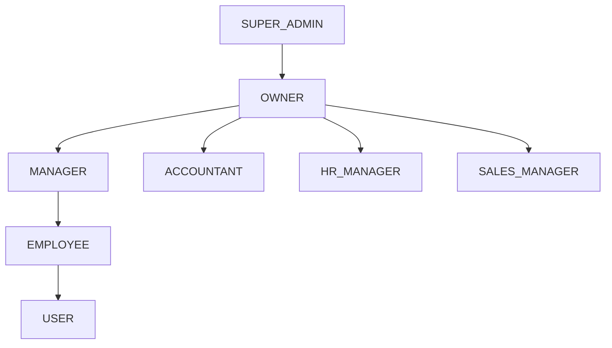
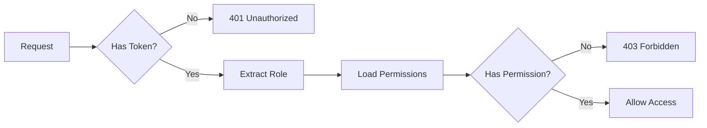

# 👥 Role Management System

## Обзор

Система управления ролями в Prometric обеспечивает гибкое распределение прав доступа и управление полномочиями пользователей в рамках организации.

## 📊 Иерархия ролей



---

## 🎭 Описание ролей

### OWNER (Владелец)
**Полный доступ к организации**

```json
{
  "role": "owner",
  "permissions": [
    "organization.*",
    "workspace.*",
    "employees.*",
    "departments.*",
    "finance.*",
    "settings.*",
    "billing.*",
    "reports.*"
  ],
  "restrictions": []
}
```

**Возможности:**
- ✅ Создание и управление организацией
- ✅ Создание workspace'ов
- ✅ Управление всеми сотрудниками
- ✅ Назначение ролей и прав
- ✅ Доступ к финансовым данным
- ✅ Управление подпиской и биллингом

### MANAGER (Менеджер)
**Управление отделом или проектом**

```json
{
  "role": "manager",
  "permissions": [
    "workspace.read",
    "employees.read",
    "employees.manage.department",
    "tasks.*",
    "projects.manage",
    "reports.department",
    "documents.manage"
  ],
  "restrictions": [
    "limited_to_department",
    "no_billing_access",
    "no_org_settings"
  ]
}
```

**Возможности:**
- ✅ Управление сотрудниками отдела
- ✅ Создание и назначение задач
- ✅ Просмотр отчетов отдела
- ✅ Одобрение заявок сотрудников
- ❌ Изменение настроек организации
- ❌ Доступ к биллингу

### EMPLOYEE (Сотрудник)
**Базовый доступ к рабочему пространству**

```json
{
  "role": "employee",
  "permissions": [
    "workspace.read",
    "tasks.read",
    "tasks.update.own",
    "documents.read",
    "documents.create",
    "profile.update.own",
    "calendar.manage.own"
  ],
  "restrictions": [
    "limited_to_assigned_tasks",
    "no_management_access",
    "department_scope_only"
  ]
}
```

**Возможности:**
- ✅ Просмотр и выполнение назначенных задач
- ✅ Создание документов
- ✅ Управление своим профилем
- ✅ Участие в проектах
- ❌ Управление другими сотрудниками
- ❌ Создание проектов

### ACCOUNTANT (Бухгалтер)
**Доступ к финансовым модулям**

```json
{
  "role": "accountant",
  "permissions": [
    "finance.read",
    "finance.manage",
    "invoices.*",
    "payments.*",
    "reports.financial",
    "documents.financial"
  ],
  "restrictions": [
    "no_employee_management",
    "no_system_settings"
  ]
}
```

### HR_MANAGER (HR Менеджер)
**Управление персоналом**

```json
{
  "role": "hr_manager",
  "permissions": [
    "employees.*",
    "departments.manage",
    "payroll.manage",
    "attendance.manage",
    "recruitment.manage",
    "training.manage"
  ],
  "restrictions": [
    "no_financial_access",
    "no_billing_access"
  ]
}
```

---

## 🔄 Процессы управления ролями

### 1. Назначение роли при регистрации

**Endpoint:** `POST /api/v1/auth/registration/select-role`

**Request Body:**
```json
{
  "role": "employee",
  "departmentPreference": "IT",
  "position": "Developer"
}
```

### 2. Изменение роли (Owner/Admin)

**Endpoint:** `PUT /api/v1/workspaces/{workspaceId}/employees/{employeeId}/role`

**Headers:**
```
Authorization: Bearer {owner_token}
```

**Request Body:**
```json
{
  "newRole": "manager",
  "departmentId": "dept-uuid",
  "permissions": ["additional.permission"],
  "reason": "Promotion to team lead"
}
```

**Response:**
```json
{
  "success": true,
  "data": {
    "employee": {
      "id": "employee-uuid",
      "role": "manager",
      "previousRole": "employee",
      "updatedAt": "2025-08-18T10:00:00Z"
    },
    "notification": "Employee and related users have been notified"
  }
}
```

---

## 🔐 Permission System

### Permission Structure

```typescript
interface Permission {
  resource: string;      // e.g., "employees", "finance", "tasks"
  action: string;        // e.g., "read", "create", "update", "delete"
  scope?: string;        // e.g., "own", "department", "organization"
  conditions?: object;   // Additional conditions
}
```

### Permission Examples

```json
{
  "permissions": [
    "tasks.read.*",           // Read all tasks
    "tasks.update.own",       // Update only own tasks
    "employees.manage.department", // Manage employees in department
    "finance.read.reports",   // Read financial reports
    "workspace.*"            // Full workspace access
  ]
}
```

### Permission Check Flow



---

## 🏢 Department-Based Permissions

### Department Roles

```json
{
  "department": "IT",
  "roles": {
    "head": {
      "permissions": ["department.*", "employees.manage", "budget.manage"]
    },
    "senior": {
      "permissions": ["tasks.manage", "projects.create", "juniors.mentor"]
    },
    "junior": {
      "permissions": ["tasks.execute", "documents.read", "training.attend"]
    }
  }
}
```

### Cross-Department Access

```json
{
  "crossDepartmentAccess": {
    "IT": ["read:HR", "read:Finance"],
    "HR": ["manage:*"],
    "Finance": ["read:*", "audit:*"]
  }
}
```

---

## 🔄 Role Transition Matrix

| From Role | To Role | Required Approval | Conditions |
|-----------|---------|------------------|------------|
| USER | EMPLOYEE | OWNER/MANAGER | Email verified, Org exists |
| EMPLOYEE | MANAGER | OWNER | Min 6 months, Performance review |
| MANAGER | OWNER | CURRENT_OWNER | Ownership transfer |
| EMPLOYEE | ACCOUNTANT | OWNER | Finance certification |
| EMPLOYEE | HR_MANAGER | OWNER | HR experience |

---

## 🛡️ Role-Based Access Control (RBAC)

### Backend Implementation

```typescript
// Guard example
@UseGuards(JwtAuthGuard, RolesGuard)
@Roles('owner', 'manager')
@Get('employees')
async getEmployees() {
  // Only owner and manager can access
}

// Permission check
@UseGuards(JwtAuthGuard, PermissionsGuard)
@RequirePermissions('employees.read', 'employees.manage')
@Post('employees/:id/update')
async updateEmployee() {
  // Requires specific permissions
}
```

### Frontend Implementation

```jsx
// Role-based rendering
{hasRole('owner') && (
  <Button onClick={handleDeleteOrganization}>
    Delete Organization
  </Button>
)}

// Permission-based rendering
{hasPermission('employees.manage') && (
  <EmployeeManagementPanel />
)}

// Department-based access
{isInDepartment('IT') && (
  <ITDashboard />
)}
```

---

## 📊 Audit Trail

### Role Change Logging

```sql
CREATE TABLE role_changes (
    id UUID PRIMARY KEY,
    employee_id UUID NOT NULL,
    previous_role VARCHAR(50),
    new_role VARCHAR(50),
    changed_by UUID NOT NULL,
    reason TEXT,
    created_at TIMESTAMP DEFAULT CURRENT_TIMESTAMP
);
```

### Sample Audit Entry

```json
{
  "id": "audit-uuid",
  "employeeId": "employee-uuid",
  "previousRole": "employee",
  "newRole": "manager",
  "changedBy": "owner-uuid",
  "reason": "Promoted to team lead",
  "metadata": {
    "department": "IT",
    "approvedBy": ["owner-uuid"],
    "effectiveDate": "2025-08-18T10:00:00Z"
  },
  "timestamp": "2025-08-18T09:00:00Z"
}
```

---

## ⚠️ Common Scenarios

### Scenario 1: New Employee Onboarding

1. Employee registers with company BIN
2. Selects "employee" role
3. Owner receives notification
4. Owner assigns department and specific role
5. Employee gets department-specific permissions

### Scenario 2: Promotion to Manager

1. Owner initiates role change
2. System checks eligibility
3. Updates role to "manager"
4. Grants additional permissions
5. Notifies employee and team
6. Logs change in audit trail

### Scenario 3: Temporary Permissions

```json
{
  "temporaryPermission": {
    "employeeId": "employee-uuid",
    "permissions": ["finance.read.reports"],
    "validFrom": "2025-08-18T00:00:00Z",
    "validUntil": "2025-08-25T23:59:59Z",
    "reason": "Temporary access for audit"
  }
}
```

---

## 🔒 Security Considerations

1. **Principle of Least Privilege** - Users get minimum required permissions
2. **Separation of Duties** - Critical operations require multiple roles
3. **Regular Audits** - Periodic review of role assignments
4. **Role Expiration** - Temporary roles auto-expire
5. **Inheritance Prevention** - Explicit permission grants only

---

## 🧪 Testing Role Management

### Test Scripts

```bash
# Test role assignment
./test-scripts/role-management/test-role-assignment.sh

# Test permission checks
./test-scripts/role-management/test-permissions.sh

# Test role transitions
./test-scripts/role-management/test-role-transitions.sh
```

### Test Cases

```javascript
describe('Role Management', () => {
  it('should assign employee role after approval', async () => {
    // Test implementation
  });
  
  it('should restrict access based on role', async () => {
    // Test implementation
  });
  
  it('should log role changes', async () => {
    // Test implementation
  });
});
```

---

## 📝 Best Practices

1. **Regular Permission Reviews** - Quarterly audit of user permissions
2. **Role Templates** - Pre-defined role sets for common positions
3. **Approval Workflows** - Multi-step approval for sensitive roles
4. **Time-based Access** - Automatic revocation of temporary permissions
5. **Training Requirements** - Mandatory training before role upgrades
6. **Emergency Access** - Break-glass procedures for critical situations
7. **Role Mining** - Analyze actual usage to optimize role definitions

---

## 🔗 Related Documentation

- [Permission Matrix](../../permissions-matrix.md)
- [API Security](../../security.md)
- [Employee Management](../employee-registration/README.md)
- [Test Scripts](../../test-scripts/role-management/README.md)

---

*Last Updated: 2025-08-18*