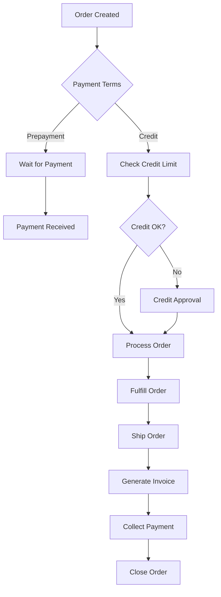
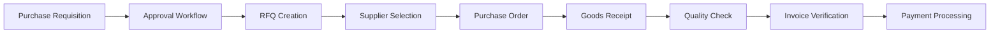
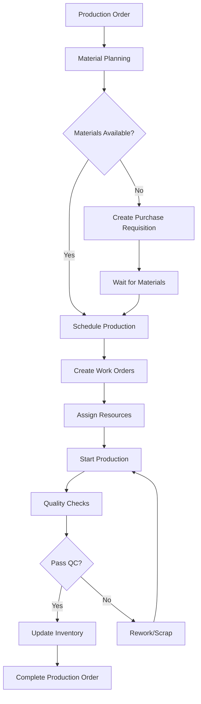
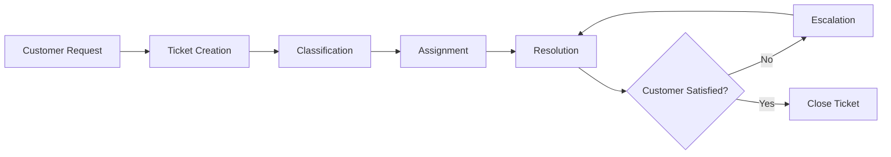

# 🎯 Business Logic - Complete Workflows and Processes

## 📌 Overview

This document describes all business logic, workflows, automation rules, and processes implemented in Prometric ERP. Each workflow is designed to maximize efficiency while maintaining data integrity and compliance with Kazakhstan business regulations.

## 🔄 Core Business Workflows

### 1. Lead to Cash (L2C) Process

```mermaid
graph LR
    A[Lead Generation] --> B[Lead Qualification]
    B --> C[Opportunity/Deal Creation]
    C --> D[Proposal & Negotiation]
    D --> E[Deal Won]
    E --> F[Order Creation]
    F --> G[Order Fulfillment]
    G --> H[Invoice Generation]
    H --> I[Payment Collection]
    I --> J[Revenue Recognition]
```



#### Detailed Flow

```typescript
// 1. Lead Generation
async function generateLead(source: LeadSource) {
  const lead = await customerService.create({
    status: 'LEAD',
    source: source,
    score: calculateInitialScore(source),
    assignedTo: getNextAvailableSalesRep()
  });
  
  // Auto-assign based on rules
  if (lead.source === 'website' && lead.score > 70) {
    await assignToSeniorRep(lead);
  }
  
  // Start nurturing campaign
  await marketingService.startCampaign(lead.id, 'lead-nurturing');
  
  return lead;
}

// 2. Lead Qualification
async function qualifyLead(leadId: string) {
  const lead = await customerService.findOne(leadId);
  
  // BANT Qualification (Budget, Authority, Need, Timeline)
  const qualificationScore = await calculateBANTScore(lead);
  
  if (qualificationScore >= 60) {
    // Convert to opportunity
    const deal = await dealService.create({
      customerId: lead.id,
      stage: 'QUALIFIED',
      probability: qualificationScore,
      expectedValue: estimateValue(lead)
    });
    
    // Update customer status
    await customerService.update(lead.id, {
      status: 'PROSPECT'
    });
    
    return { qualified: true, dealId: deal.id };
  }
  
  // Continue nurturing
  await marketingService.continueCampaign(lead.id);
  return { qualified: false };
}

// 3. Deal Management
async function manageDeal(dealId: string) {
  const deal = await dealService.findOne(dealId);
  
  // Stage progression rules
  const stageRules = {
    QUALIFIED: {
      nextStage: 'PROPOSAL',
      requirements: ['needs_analysis_complete', 'budget_confirmed'],
      probability: 30
    },
    PROPOSAL: {
      nextStage: 'NEGOTIATION',
      requirements: ['proposal_sent', 'proposal_accepted'],
      probability: 50
    },
    NEGOTIATION: {
      nextStage: 'CLOSING',
      requirements: ['terms_agreed', 'contract_drafted'],
      probability: 75
    },
    CLOSING: {
      nextStage: 'WON',
      requirements: ['contract_signed', 'payment_terms_agreed'],
      probability: 90
    }
  };
  
  // Check stage requirements
  const currentRequirements = stageRules[deal.stage];
  const requirementsMet = await checkRequirements(
    deal,
    currentRequirements.requirements
  );
  
  if (requirementsMet) {
    await dealService.update(dealId, {
      stage: currentRequirements.nextStage,
      probability: currentRequirements.probability
    });
  }
}

// 4. Deal Won Orchestration
@Injectable()
export class DealWonOrchestrator {
  @OnEvent('deal.won')
  async handleDealWon(event: DealWonEvent) {
    const { dealId, customerId, userId, workspaceId, organizationId } = event;
    
    try {
      // Start transaction
      await this.dataSource.transaction(async manager => {
        // 1. Update customer to ACTIVE
        await manager.update(Customer, customerId, {
          status: 'ACTIVE',
          lastPurchaseDate: new Date(),
          lifetimeValue: () => `lifetimeValue + ${event.dealValue}`
        });
        
        // 2. Create Sales Order
        const order = await manager.save(Order, {
          dealId,
          customerId,
          type: 'SALES',
          status: 'pending',
          totalAmount: event.dealValue,
          items: event.dealProducts.map(p => ({
            productId: p.productId,
            quantity: p.quantity,
            unitPrice: p.unitPrice,
            discount: p.discount,
            tax: p.tax
          })),
          workspaceId,
          organizationId
        });
        
        // 3. Check inventory and create Production Orders if needed
        for (const item of order.items) {
          const stock = await this.inventoryService.checkStock(
            item.productId,
            item.quantity
          );
          
          if (stock.available < item.quantity) {
            const productionQty = item.quantity - stock.available;
            
            await manager.save(ProductionOrder, {
              orderId: order.id,
              productId: item.productId,
              quantity: productionQty,
              priority: this.calculatePriority(order),
              dueDate: order.deliveryDate,
              status: 'pending',
              workspaceId,
              organizationId
            });
            
            // Reserve available stock
            if (stock.available > 0) {
              await this.inventoryService.reserve(
                item.productId,
                stock.available,
                order.id
              );
            }
          } else {
            // Reserve all from stock
            await this.inventoryService.reserve(
              item.productId,
              item.quantity,
              order.id
            );
          }
        }
        
        // 4. Create Invoice
        const invoice = await manager.save(Invoice, {
          orderId: order.id,
          customerId,
          dealId,
          amount: event.dealValue,
          status: 'draft',
          dueDate: this.calculateDueDate(customerId),
          items: order.items.map(item => ({
            description: item.product.name,
            quantity: item.quantity,
            unitPrice: item.unitPrice,
            tax: item.tax,
            amount: item.totalPrice
          })),
          workspaceId,
          organizationId
        });
        
        // 5. Create initial tasks
        const tasks = [
          {
            title: 'Review and approve order',
            type: 'order_approval',
            assignedTo: event.managerId,
            dueDate: addDays(new Date(), 1),
            priority: 'high',
            relatedEntity: 'order',
            relatedId: order.id
          },
          {
            title: 'Send invoice to customer',
            type: 'invoice_sending',
            assignedTo: event.userId,
            dueDate: addDays(new Date(), 2),
            priority: 'medium',
            relatedEntity: 'invoice',
            relatedId: invoice.id
          }
        ];
        
        for (const task of tasks) {
          await manager.save(Task, {
            ...task,
            status: 'pending',
            workspaceId,
            organizationId
          });
        }
        
        // 6. Update sales metrics
        await this.updateSalesMetrics({
          userId: event.userId,
          dealValue: event.dealValue,
          dealId,
          customerId
        });
        
        // 7. Send notifications
        await this.notificationService.sendMultiple([
          {
            to: event.userId,
            type: 'deal_won',
            data: { dealId, amount: event.dealValue }
          },
          {
            to: event.managerId,
            type: 'order_approval_required',
            data: { orderId: order.id }
          },
          {
            to: customerId,
            type: 'order_confirmation',
            data: { orderNumber: order.orderNumber }
          }
        ]);
        
        // 8. Emit order.created event for next orchestrator
        this.eventEmitter.emit('order.created', {
          orderId: order.id,
          customerId,
          hasProductionOrders: order.productionOrders?.length > 0,
          workspaceId,
          organizationId
        });
      });
      
      this.logger.log(`✅ Deal won orchestration completed for ${dealId}`);
      
    } catch (error) {
      this.logger.error(`❌ Deal won orchestration failed for ${dealId}`, error);
      
      // Compensating transaction
      await this.rollbackDealWon(dealId);
      
      throw error;
    }
  }
}
```

### 2. Order to Cash (O2C) Process



#### Implementation

```typescript
// Order Processing Logic
@Injectable()
export class OrderProcessingService {
  async processOrder(orderId: string) {
    const order = await this.orderRepository.findOne(orderId, {
      relations: ['customer', 'items', 'items.product']
    });
    
    // 1. Validate order
    await this.validateOrder(order);
    
    // 2. Check payment terms
    const paymentValidation = await this.validatePaymentTerms(order);
    
    if (paymentValidation.requiresPrepayment) {
      // Wait for payment
      order.status = 'awaiting_payment';
      await this.orderRepository.save(order);
      
      // Create proforma invoice
      await this.invoiceService.createProforma(order);
      
      return { status: 'awaiting_payment' };
    }
    
    // 3. Check credit limit for credit customers
    if (order.customer.paymentTerms !== 'PREPAYMENT') {
      const creditCheck = await this.checkCreditLimit(order);
      
      if (!creditCheck.approved) {
        // Require approval
        order.status = 'pending_approval';
        order.approvalRequired = 'credit_limit_exceeded';
        await this.orderRepository.save(order);
        
        // Notify credit manager
        await this.notificationService.notifyCreditManager(order);
        
        return { status: 'pending_approval' };
      }
    }
    
    // 4. Check inventory
    const inventoryCheck = await this.checkInventory(order);
    
    if (!inventoryCheck.allAvailable) {
      // Create production/purchase orders
      await this.handleInventoryShortage(order, inventoryCheck);
    }
    
    // 5. Reserve inventory
    await this.reserveInventory(order);
    
    // 6. Update order status
    order.status = 'processing';
    await this.orderRepository.save(order);
    
    // 7. Start fulfillment
    await this.startFulfillment(order);
    
    return { status: 'processing' };
  }
  
  private async validateOrder(order: Order) {
    // Check required fields
    if (!order.customer) {
      throw new ValidationException('Customer is required');
    }
    
    if (!order.items?.length) {
      throw new ValidationException('Order must have at least one item');
    }
    
    // Validate shipping address
    if (!order.shippingAddress) {
      // Use default address
      order.shippingAddress = await this.getDefaultAddress(order.customerId);
    }
    
    // Validate products
    for (const item of order.items) {
      const product = await this.productService.findOne(item.productId);
      
      if (product.status !== 'ACTIVE') {
        throw new ValidationException(
          `Product ${product.name} is not available`
        );
      }
      
      // Check minimum order quantity
      if (item.quantity < product.minOrderQuantity) {
        throw new ValidationException(
          `Minimum order quantity for ${product.name} is ${product.minOrderQuantity}`
        );
      }
    }
    
    // Calculate totals
    order.subtotal = order.items.reduce(
      (sum, item) => sum + (item.unitPrice * item.quantity),
      0
    );
    
    order.taxAmount = order.items.reduce(
      (sum, item) => sum + (item.unitPrice * item.quantity * item.tax / 100),
      0
    );
    
    order.totalAmount = order.subtotal + order.taxAmount - (order.discount || 0);
  }
  
  private async checkCreditLimit(order: Order): Promise<CreditCheckResult> {
    const customer = order.customer;
    
    // Get current balance
    const currentBalance = await this.getCustomerBalance(customer.id);
    
    // Calculate new balance after order
    const newBalance = currentBalance + order.totalAmount;
    
    if (newBalance > customer.creditLimit) {
      // Check if customer has good payment history
      const paymentHistory = await this.getPaymentHistory(customer.id);
      
      if (paymentHistory.score >= 8) {
        // Auto-approve with temporary limit increase
        await this.increaseCreditLimit(
          customer.id,
          newBalance * 1.1,
          'temporary'
        );
        
        return { approved: true, autoApproved: true };
      }
      
      return {
        approved: false,
        reason: 'credit_limit_exceeded',
        currentLimit: customer.creditLimit,
        required: newBalance
      };
    }
    
    return { approved: true };
  }
}
```

### 3. Procure to Pay (P2P) Process



#### Implementation

```typescript
// Procurement Process
@Injectable()
export class ProcurementService {
  async createRequisition(data: CreateRequisitionDto) {
    // 1. Validate requisition
    const requisition = await this.validateRequisition(data);
    
    // 2. Check budget
    const budgetCheck = await this.checkBudget(
      data.departmentId,
      data.estimatedCost
    );
    
    if (!budgetCheck.available) {
      requisition.status = 'budget_exceeded';
      requisition.blockedReason = budgetCheck.reason;
      await this.requisitionRepository.save(requisition);
      
      // Notify department head
      await this.notifyBudgetExceeded(requisition);
      
      return requisition;
    }
    
    // 3. Determine approval workflow
    const approvalLevels = this.determineApprovalLevels(requisition);
    
    // 4. Create approval chain
    for (const level of approvalLevels) {
      await this.approvalService.createApproval({
        entityType: 'requisition',
        entityId: requisition.id,
        approverId: level.approverId,
        level: level.level,
        threshold: level.threshold,
        status: 'pending'
      });
    }
    
    // 5. Start approval process
    await this.startApprovalProcess(requisition);
    
    return requisition;
  }
  
  private determineApprovalLevels(requisition: Requisition): ApprovalLevel[] {
    const levels: ApprovalLevel[] = [];
    const amount = requisition.estimatedCost;
    
    // Level 1: Direct manager (always required)
    levels.push({
      level: 1,
      approverId: requisition.requestor.managerId,
      threshold: 0
    });
    
    // Level 2: Department head (> 500,000 KZT)
    if (amount > 500000) {
      levels.push({
        level: 2,
        approverId: requisition.department.headId,
        threshold: 500000
      });
    }
    
    // Level 3: Finance manager (> 2,000,000 KZT)
    if (amount > 2000000) {
      levels.push({
        level: 3,
        approverId: this.getFinanceManagerId(),
        threshold: 2000000
      });
    }
    
    // Level 4: CEO (> 10,000,000 KZT)
    if (amount > 10000000) {
      levels.push({
        level: 4,
        approverId: this.getCEOId(),
        threshold: 10000000
      });
    }
    
    return levels;
  }
  
  async processApproval(approvalId: string, decision: ApprovalDecision) {
    const approval = await this.approvalRepository.findOne(approvalId);
    const requisition = await this.requisitionRepository.findOne(
      approval.entityId
    );
    
    if (decision.approved) {
      approval.status = 'approved';
      approval.approvedAt = new Date();
      approval.comments = decision.comments;
      await this.approvalRepository.save(approval);
      
      // Check if all approvals complete
      const allApprovals = await this.approvalRepository.find({
        where: { entityId: requisition.id }
      });
      
      const allApproved = allApprovals.every(a => a.status === 'approved');
      
      if (allApproved) {
        // Move to RFQ creation
        await this.createRFQ(requisition);
      } else {
        // Move to next approval level
        const nextLevel = await this.getNextApprovalLevel(requisition);
        if (nextLevel) {
          await this.notifyApprover(nextLevel.approverId, requisition);
        }
      }
    } else {
      // Rejection
      approval.status = 'rejected';
      approval.rejectedAt = new Date();
      approval.rejectionReason = decision.reason;
      await this.approvalRepository.save(approval);
      
      // Update requisition
      requisition.status = 'rejected';
      await this.requisitionRepository.save(requisition);
      
      // Notify requestor
      await this.notifyRejection(requisition, decision);
    }
  }
  
  async createRFQ(requisition: Requisition) {
    // 1. Find qualified suppliers
    const suppliers = await this.findQualifiedSuppliers(requisition);
    
    // 2. Create RFQ
    const rfq = await this.rfqRepository.save({
      requisitionId: requisition.id,
      status: 'draft',
      deadline: addDays(new Date(), 7),
      items: requisition.items,
      terms: this.getStandardTerms(),
      evaluationCriteria: {
        price: 40,
        quality: 30,
        delivery: 20,
        payment: 10
      }
    });
    
    // 3. Send to suppliers
    for (const supplier of suppliers) {
      await this.sendRFQToSupplier(rfq, supplier);
    }
    
    // 4. Start monitoring responses
    await this.startRFQMonitoring(rfq);
    
    return rfq;
  }
}
```

### 4. Manufacturing Process



#### Implementation

```typescript
// Manufacturing Process
@Injectable()
export class ManufacturingService {
  async processProductionOrder(productionOrderId: string) {
    const order = await this.productionOrderRepository.findOne(
      productionOrderId,
      { relations: ['product', 'salesOrder'] }
    );
    
    // 1. Get BOM (Bill of Materials)
    const bom = await this.bomService.getForProduct(order.productId);
    
    // 2. Calculate material requirements
    const requirements = this.calculateMaterialRequirements(bom, order.quantity);
    
    // 3. Check material availability
    const availability = await this.checkMaterialAvailability(requirements);
    
    if (!availability.allAvailable) {
      // Create purchase requisitions for missing materials
      for (const missing of availability.missing) {
        await this.procurementService.createRequisition({
          type: 'material',
          materialId: missing.materialId,
          quantity: missing.quantity,
          requiredBy: order.dueDate,
          priority: order.priority,
          productionOrderId: order.id
        });
      }
      
      // Update status
      order.status = 'waiting_materials';
      await this.productionOrderRepository.save(order);
      
      return { status: 'waiting_materials' };
    }
    
    // 4. Reserve materials
    await this.reserveMaterials(requirements, order.id);
    
    // 5. Schedule production
    const schedule = await this.scheduleProduction(order);
    
    // 6. Create work orders for each operation
    const workOrders = await this.createWorkOrders(order, bom, schedule);
    
    // 7. Assign resources
    for (const workOrder of workOrders) {
      await this.assignResources(workOrder);
    }
    
    // 8. Update status
    order.status = 'scheduled';
    order.scheduledStart = schedule.startDate;
    order.scheduledEnd = schedule.endDate;
    await this.productionOrderRepository.save(order);
    
    // 9. Start first work order
    await this.startWorkOrder(workOrders[0]);
    
    return { status: 'scheduled', workOrders };
  }
  
  private async scheduleProduction(order: ProductionOrder): Promise<Schedule> {
    // Get production capacity
    const capacity = await this.getProductionCapacity(
      order.product.productionLine
    );
    
    // Get existing schedule
    const existingSchedule = await this.getExistingSchedule(
      order.product.productionLine
    );
    
    // Find optimal slot
    const slot = this.findOptimalSlot(
      existingSchedule,
      order.estimatedDuration,
      order.dueDate,
      order.priority
    );
    
    // Handle priority orders
    if (order.priority === 'urgent' && !slot.meetsDeadline) {
      // Reschedule lower priority orders
      await this.rescheduleForUrgentOrder(order, slot);
    }
    
    return {
      startDate: slot.start,
      endDate: slot.end,
      productionLine: order.product.productionLine,
      shift: slot.shift
    };
  }
  
  async executeWorkOrder(workOrderId: string) {
    const workOrder = await this.workOrderRepository.findOne(workOrderId);
    
    // 1. Verify prerequisites
    await this.verifyPrerequisites(workOrder);
    
    // 2. Issue materials
    await this.issueMaterials(workOrder);
    
    // 3. Start operation
    workOrder.status = 'in_progress';
    workOrder.startedAt = new Date();
    await this.workOrderRepository.save(workOrder);
    
    // 4. Monitor progress
    const monitoring = setInterval(async () => {
      const progress = await this.getWorkOrderProgress(workOrderId);
      
      // Update progress
      workOrder.completedQuantity = progress.completed;
      await this.workOrderRepository.save(workOrder);
      
      // Check for issues
      if (progress.issues.length > 0) {
        await this.handleProductionIssues(workOrder, progress.issues);
      }
      
      // Check completion
      if (progress.completed >= workOrder.quantity) {
        clearInterval(monitoring);
        await this.completeWorkOrder(workOrder);
      }
    }, 60000); // Check every minute
  }
  
  private async completeWorkOrder(workOrder: WorkOrder) {
    // 1. Quality inspection
    const qcResult = await this.qualityControl(workOrder);
    
    if (qcResult.passed) {
      // 2. Update work order
      workOrder.status = 'completed';
      workOrder.completedAt = new Date();
      workOrder.qcStatus = 'passed';
      await this.workOrderRepository.save(workOrder);
      
      // 3. Move to next operation or complete
      const nextOperation = await this.getNextOperation(workOrder);
      
      if (nextOperation) {
        // Start next work order
        await this.startWorkOrder(nextOperation);
      } else {
        // Complete production order
        await this.completeProductionOrder(workOrder.productionOrderId);
      }
    } else {
      // Handle QC failure
      await this.handleQCFailure(workOrder, qcResult);
    }
  }
}
```

### 5. Customer Service Process



#### Implementation

```typescript
// Customer Service Process
@Injectable()
export class CustomerServiceProcess {
  async handleCustomerRequest(request: CustomerRequest) {
    // 1. Create ticket
    const ticket = await this.createTicket(request);
    
    // 2. Classify ticket
    const classification = await this.classifyTicket(ticket);
    
    // 3. Assign to agent
    const agent = await this.assignAgent(ticket, classification);
    
    // 4. Set SLA
    const sla = this.setSLA(classification);
    
    // 5. Start resolution process
    await this.startResolution(ticket, agent, sla);
    
    return ticket;
  }
  
  private async classifyTicket(ticket: Ticket): Promise<Classification> {
    // Use AI for classification
    const aiClassification = await this.aiService.classify({
      text: ticket.description,
      context: {
        customer: ticket.customer,
        previousTickets: await this.getPreviousTickets(ticket.customerId)
      }
    });
    
    // Determine priority
    const priority = this.calculatePriority({
      customerTier: ticket.customer.tier,
      issueType: aiClassification.type,
      impact: aiClassification.impact,
      urgency: aiClassification.urgency
    });
    
    return {
      type: aiClassification.type,
      category: aiClassification.category,
      priority,
      requiredSkills: aiClassification.requiredSkills,
      estimatedTime: aiClassification.estimatedTime
    };
  }
  
  private async assignAgent(
    ticket: Ticket,
    classification: Classification
  ): Promise<Agent> {
    // Find available agents with required skills
    const availableAgents = await this.findAvailableAgents(
      classification.requiredSkills
    );
    
    // Score agents
    const scores = availableAgents.map(agent => ({
      agent,
      score: this.scoreAgent(agent, ticket, classification)
    }));
    
    // Sort by score
    scores.sort((a, b) => b.score - a.score);
    
    // Assign to best agent
    const bestAgent = scores[0].agent;
    
    await this.assignTicketToAgent(ticket, bestAgent);
    
    return bestAgent;
  }
  
  private scoreAgent(
    agent: Agent,
    ticket: Ticket,
    classification: Classification
  ): number {
    let score = 0;
    
    // Skill match
    const skillMatch = agent.skills.filter(
      s => classification.requiredSkills.includes(s)
    ).length;
    score += skillMatch * 20;
    
    // Previous experience with customer
    if (agent.previousCustomers.includes(ticket.customerId)) {
      score += 15;
    }
    
    // Current workload
    score -= agent.currentTickets * 5;
    
    // Performance rating
    score += agent.performanceRating * 10;
    
    // Language match
    if (agent.languages.includes(ticket.customer.preferredLanguage)) {
      score += 10;
    }
    
    return score;
  }
}
```

## 🎯 Business Rules Engine

### Rule Definition Structure

```typescript
interface BusinessRule {
  id: string;
  name: string;
  description: string;
  module: Module;
  entity: string;
  trigger: TriggerType;
  conditions: Condition[];
  actions: Action[];
  priority: number;
  active: boolean;
}

interface Condition {
  field: string;
  operator: Operator;
  value: any;
  logic?: 'AND' | 'OR';
}

interface Action {
  type: ActionType;
  target: string;
  params: any;
}
```

### Key Business Rules

```typescript
// 1. Automatic Customer Upgrade Rule
const customerUpgradeRule: BusinessRule = {
  id: 'rule-customer-upgrade',
  name: 'Automatic Customer Tier Upgrade',
  module: 'sales',
  entity: 'customer',
  trigger: 'order.completed',
  conditions: [
    {
      field: 'customer.lifetimeValue',
      operator: 'greater_than',
      value: 10000000
    },
    {
      field: 'customer.orderCount',
      operator: 'greater_than',
      value: 10,
      logic: 'AND'
    }
  ],
  actions: [
    {
      type: 'update_field',
      target: 'customer.tier',
      params: { value: 'gold' }
    },
    {
      type: 'update_field',
      target: 'customer.creditLimit',
      params: { value: 5000000 }
    },
    {
      type: 'send_notification',
      target: 'customer',
      params: {
        template: 'tier_upgrade',
        data: { newTier: 'gold' }
      }
    }
  ],
  priority: 1,
  active: true
};

// 2. Low Stock Alert Rule
const lowStockRule: BusinessRule = {
  id: 'rule-low-stock',
  name: 'Low Stock Alert',
  module: 'inventory',
  entity: 'product',
  trigger: 'inventory.updated',
  conditions: [
    {
      field: 'product.stockLevel',
      operator: 'less_than',
      value: 'product.minStockLevel'
    }
  ],
  actions: [
    {
      type: 'create_requisition',
      target: 'procurement',
      params: {
        quantity: 'product.reorderQuantity',
        priority: 'high'
      }
    },
    {
      type: 'send_notification',
      target: 'inventory_manager',
      params: {
        template: 'low_stock_alert'
      }
    }
  ],
  priority: 1,
  active: true
};

// 3. Deal Probability Auto-Update
const dealProbabilityRule: BusinessRule = {
  id: 'rule-deal-probability',
  name: 'Deal Probability Auto-Update',
  module: 'sales',
  entity: 'deal',
  trigger: 'deal.stage.changed',
  conditions: [
    {
      field: 'deal.stage',
      operator: 'in',
      value: ['QUALIFIED', 'PROPOSAL', 'NEGOTIATION', 'CLOSING']
    }
  ],
  actions: [
    {
      type: 'update_field',
      target: 'deal.probability',
      params: {
        value: {
          'QUALIFIED': 30,
          'PROPOSAL': 50,
          'NEGOTIATION': 75,
          'CLOSING': 90
        }
      }
    }
  ],
  priority: 2,
  active: true
};
```

## 📊 Approval Workflows

### Approval Matrix

```typescript
const approvalMatrix = {
  // Purchase Approvals
  purchase: {
    levels: [
      {
        threshold: 100000,
        approver: 'direct_manager',
        escalationTime: 24 // hours
      },
      {
        threshold: 500000,
        approver: 'department_head',
        escalationTime: 24
      },
      {
        threshold: 2000000,
        approver: 'finance_manager',
        escalationTime: 48
      },
      {
        threshold: 10000000,
        approver: 'ceo',
        escalationTime: 72
      }
    ]
  },
  
  // Discount Approvals
  discount: {
    levels: [
      {
        threshold: 5, // percentage
        approver: 'sales_rep',
        escalationTime: 0 // immediate
      },
      {
        threshold: 10,
        approver: 'sales_manager',
        escalationTime: 12
      },
      {
        threshold: 20,
        approver: 'sales_director',
        escalationTime: 24
      },
      {
        threshold: 100, // any discount above 20%
        approver: 'ceo',
        escalationTime: 48
      }
    ]
  },
  
  // Credit Limit Approvals
  creditLimit: {
    levels: [
      {
        threshold: 1000000,
        approver: 'sales_manager',
        escalationTime: 24
      },
      {
        threshold: 5000000,
        approver: 'finance_manager',
        escalationTime: 24
      },
      {
        threshold: 20000000,
        approver: 'cfo',
        escalationTime: 48
      }
    ]
  },
  
  // Leave Approvals
  leave: {
    levels: [
      {
        threshold: 3, // days
        approver: 'direct_manager',
        escalationTime: 24
      },
      {
        threshold: 7,
        approver: 'department_head',
        escalationTime: 48
      },
      {
        threshold: 30,
        approver: 'hr_manager',
        escalationTime: 48
      }
    ]
  }
};
```

### Approval Process Implementation

```typescript
@Injectable()
export class ApprovalService {
  async createApprovalRequest(request: ApprovalRequest) {
    // 1. Determine approval type and level
    const approvalConfig = approvalMatrix[request.type];
    const level = this.determineApprovalLevel(
      request.value,
      approvalConfig.levels
    );
    
    // 2. Create approval record
    const approval = await this.approvalRepository.save({
      type: request.type,
      entityType: request.entityType,
      entityId: request.entityId,
      requestorId: request.requestorId,
      approverId: await this.getApproverId(level.approver, request),
      value: request.value,
      status: 'pending',
      level: level.level,
      dueDate: addHours(new Date(), level.escalationTime),
      metadata: request.metadata
    });
    
    // 3. Send notification to approver
    await this.notificationService.send({
      to: approval.approverId,
      type: 'approval_request',
      data: {
        approvalId: approval.id,
        type: request.type,
        description: request.description,
        urgency: this.calculateUrgency(level.escalationTime)
      }
    });
    
    // 4. Set up escalation
    if (level.escalationTime > 0) {
      await this.scheduleEscalation(approval);
    }
    
    // 5. Set up auto-approval if configured
    if (this.isAutoApprovalEnabled(request)) {
      await this.scheduleAutoApproval(approval);
    }
    
    return approval;
  }
  
  async processApprovalDecision(
    approvalId: string,
    decision: ApprovalDecision
  ) {
    const approval = await this.approvalRepository.findOne(approvalId);
    
    if (approval.status !== 'pending') {
      throw new Error('Approval already processed');
    }
    
    // 1. Update approval record
    approval.status = decision.approved ? 'approved' : 'rejected';
    approval.decidedAt = new Date();
    approval.decidedBy = decision.deciderId;
    approval.comments = decision.comments;
    
    if (!decision.approved) {
      approval.rejectionReason = decision.reason;
    }
    
    await this.approvalRepository.save(approval);
    
    // 2. Cancel escalation
    await this.cancelEscalation(approvalId);
    
    // 3. Process decision
    if (decision.approved) {
      // Check if multi-level approval needed
      const nextLevel = await this.getNextApprovalLevel(approval);
      
      if (nextLevel) {
        // Create next level approval
        await this.createApprovalRequest({
          ...approval,
          level: nextLevel.level,
          approverId: await this.getApproverId(nextLevel.approver, approval)
        });
      } else {
        // All approvals complete
        await this.executeApprovedAction(approval);
      }
    } else {
      // Notify requestor of rejection
      await this.notifyRejection(approval);
    }
    
    // 4. Update audit trail
    await this.auditService.log({
      action: 'approval_decision',
      entityType: approval.entityType,
      entityId: approval.entityId,
      userId: decision.deciderId,
      data: {
        approved: decision.approved,
        reason: decision.reason
      }
    });
  }
  
  private async scheduleEscalation(approval: Approval) {
    await this.queue.add(
      'approval-escalation',
      {
        approvalId: approval.id
      },
      {
        delay: approval.dueDate.getTime() - Date.now()
      }
    );
  }
  
  @Process('approval-escalation')
  async handleEscalation(job: Job) {
    const { approvalId } = job.data;
    const approval = await this.approvalRepository.findOne(approvalId);
    
    if (approval.status === 'pending') {
      // Get next level approver
      const escalationApprover = await this.getEscalationApprover(approval);
      
      // Update approval
      approval.escalated = true;
      approval.escalatedTo = escalationApprover.id;
      approval.escalatedAt = new Date();
      await this.approvalRepository.save(approval);
      
      // Notify escalation
      await this.notificationService.sendMultiple([
        {
          to: escalationApprover.id,
          type: 'approval_escalated',
          priority: 'high',
          data: approval
        },
        {
          to: approval.approverId,
          type: 'approval_escalation_notice',
          data: {
            message: 'Approval escalated due to timeout'
          }
        }
      ]);
    }
  }
}
```

## 🔄 Automation Rules

### Inventory Management Automation

```typescript
// Automatic Reorder Point Calculation
@Injectable()
export class InventoryAutomation {
  @Cron('0 0 * * *') // Daily at midnight
  async calculateReorderPoints() {
    const products = await this.productRepository.find({
      where: { status: 'ACTIVE' }
    });
    
    for (const product of products) {
      // Get historical data
      const history = await this.getUsageHistory(product.id, 90); // 90 days
      
      // Calculate average daily usage
      const avgDailyUsage = history.totalUsage / 90;
      
      // Calculate lead time demand
      const leadTimeDemand = avgDailyUsage * product.leadTime;
      
      // Calculate safety stock (using standard deviation)
      const stdDev = this.calculateStdDev(history.dailyUsage);
      const safetyStock = 1.65 * stdDev * Math.sqrt(product.leadTime); // 95% service level
      
      // Calculate reorder point
      const reorderPoint = leadTimeDemand + safetyStock;
      
      // Calculate economic order quantity (EOQ)
      const annualDemand = avgDailyUsage * 365;
      const orderingCost = 5000; // KZT per order
      const holdingCostRate = 0.25; // 25% of product cost
      const holdingCost = product.cost * holdingCostRate;
      
      const eoq = Math.sqrt((2 * annualDemand * orderingCost) / holdingCost);
      
      // Update product
      await this.productRepository.update(product.id, {
        reorderPoint: Math.ceil(reorderPoint),
        reorderQuantity: Math.ceil(eoq),
        safetyStock: Math.ceil(safetyStock)
      });
      
      // Check current stock
      if (product.stockLevel <= reorderPoint) {
        await this.createAutomaticPurchaseOrder(product, eoq);
      }
    }
  }
}
```

### Customer Engagement Automation

```typescript
// Customer Engagement Rules
@Injectable()
export class CustomerEngagementAutomation {
  // New Customer Onboarding
  @OnEvent('customer.created')
  async onboardNewCustomer(event: CustomerCreatedEvent) {
    const { customerId } = event;
    
    // 1. Send welcome email
    await this.emailService.send({
      to: customerId,
      template: 'welcome',
      data: {
        customerName: event.customerName,
        onboardingLink: this.generateOnboardingLink(customerId)
      }
    });
    
    // 2. Assign account manager
    const accountManager = await this.assignAccountManager(customerId);
    
    // 3. Schedule onboarding calls
    const tasks = [
      {
        title: 'Welcome call',
        dueDate: addDays(new Date(), 1),
        assignedTo: accountManager.id
      },
      {
        title: 'Product demo',
        dueDate: addDays(new Date(), 3),
        assignedTo: accountManager.id
      },
      {
        title: 'Follow-up call',
        dueDate: addDays(new Date(), 7),
        assignedTo: accountManager.id
      }
    ];
    
    for (const task of tasks) {
      await this.taskService.create({
        ...task,
        customerId,
        type: 'customer_onboarding'
      });
    }
    
    // 4. Start nurturing campaign
    await this.campaignService.enroll(customerId, 'new-customer-nurture');
  }
  
  // Churn Prevention
  @Cron('0 9 * * MON') // Every Monday at 9 AM
  async identifyChurnRisk() {
    const customers = await this.customerRepository.find({
      where: { status: 'ACTIVE' }
    });
    
    for (const customer of customers) {
      const riskScore = await this.calculateChurnRisk(customer);
      
      if (riskScore > 0.7) {
        // High risk - immediate action
        await this.initiateRetentionProgram(customer, 'high');
      } else if (riskScore > 0.4) {
        // Medium risk - proactive engagement
        await this.initiateRetentionProgram(customer, 'medium');
      }
      
      // Update customer record
      await this.customerRepository.update(customer.id, {
        churnRiskScore: riskScore,
        churnRiskCalculatedAt: new Date()
      });
    }
  }
  
  private async calculateChurnRisk(customer: Customer): Promise<number> {
    let riskScore = 0;
    const weights = {
      recency: 0.3,
      frequency: 0.2,
      monetary: 0.2,
      support: 0.15,
      engagement: 0.15
    };
    
    // Recency (last order)
    const daysSinceLastOrder = this.daysSince(customer.lastOrderDate);
    if (daysSinceLastOrder > 90) riskScore += weights.recency;
    else if (daysSinceLastOrder > 60) riskScore += weights.recency * 0.5;
    
    // Frequency (order frequency decline)
    const frequencyTrend = await this.getOrderFrequencyTrend(customer.id);
    if (frequencyTrend < -0.3) riskScore += weights.frequency;
    else if (frequencyTrend < 0) riskScore += weights.frequency * 0.5;
    
    // Monetary (spending decline)
    const spendingTrend = await this.getSpendingTrend(customer.id);
    if (spendingTrend < -0.3) riskScore += weights.monetary;
    else if (spendingTrend < 0) riskScore += weights.monetary * 0.5;
    
    // Support tickets
    const recentTickets = await this.getRecentSupportTickets(customer.id);
    if (recentTickets.unresolved > 2) riskScore += weights.support;
    else if (recentTickets.negative > 3) riskScore += weights.support * 0.7;
    
    // Engagement (email opens, portal logins)
    const engagement = await this.getEngagementScore(customer.id);
    if (engagement < 0.2) riskScore += weights.engagement;
    else if (engagement < 0.5) riskScore += weights.engagement * 0.5;
    
    return riskScore;
  }
}
```

## 📈 Performance Optimization Rules

### Query Optimization

```typescript
// Smart Query Batching
@Injectable()
export class QueryOptimizer {
  private batchQueue = new Map<string, any[]>();
  private batchTimers = new Map<string, NodeJS.Timeout>();
  
  async batchedFind<T>(
    entity: string,
    id: string,
    options?: FindOptions
  ): Promise<T> {
    return new Promise((resolve, reject) => {
      const key = `${entity}:${JSON.stringify(options || {})}`;
      
      if (!this.batchQueue.has(key)) {
        this.batchQueue.set(key, []);
      }
      
      this.batchQueue.get(key).push({ id, resolve, reject });
      
      // Clear existing timer
      if (this.batchTimers.has(key)) {
        clearTimeout(this.batchTimers.get(key));
      }
      
      // Set new timer
      const timer = setTimeout(() => {
        this.executeBatch(key, entity, options);
      }, 10); // 10ms batch window
      
      this.batchTimers.set(key, timer);
    });
  }
  
  private async executeBatch(
    key: string,
    entity: string,
    options?: FindOptions
  ) {
    const batch = this.batchQueue.get(key);
    if (!batch || batch.length === 0) return;
    
    const ids = batch.map(item => item.id);
    
    try {
      // Execute single query for all IDs
      const results = await this.dataSource
        .getRepository(entity)
        .findByIds(ids, options);
      
      // Map results back to promises
      const resultMap = new Map(results.map(r => [r.id, r]));
      
      batch.forEach(item => {
        const result = resultMap.get(item.id);
        if (result) {
          item.resolve(result);
        } else {
          item.reject(new Error(`Entity not found: ${item.id}`));
        }
      });
    } catch (error) {
      batch.forEach(item => item.reject(error));
    }
    
    // Clear batch
    this.batchQueue.delete(key);
    this.batchTimers.delete(key);
  }
}
```

### Cache Warming

```typescript
// Proactive Cache Warming
@Injectable()
export class CacheWarmer {
  @Cron('0 6 * * *') // Every day at 6 AM
  async warmCache() {
    // 1. Warm product cache
    const activeProducts = await this.productRepository.find({
      where: { status: 'ACTIVE' },
      order: { popularity: 'DESC' },
      take: 100
    });
    
    for (const product of activeProducts) {
      await this.cacheService.set(
        `product:${product.id}`,
        product,
        3600 // 1 hour
      );
    }
    
    // 2. Warm customer cache
    const vipCustomers = await this.customerRepository.find({
      where: { tier: In(['gold', 'platinum']) }
    });
    
    for (const customer of vipCustomers) {
      await this.cacheService.set(
        `customer:${customer.id}`,
        customer,
        3600
      );
    }
    
    // 3. Warm frequently accessed reports
    const reports = [
      'daily-sales',
      'inventory-status',
      'pending-orders',
      'production-schedule'
    ];
    
    for (const report of reports) {
      const data = await this.reportService.generate(report);
      await this.cacheService.set(`report:${report}`, data, 1800);
    }
    
    this.logger.log('✅ Cache warming completed');
  }
}
```

## 🔐 Security & Compliance Rules

### Data Access Control

```typescript
// Row-Level Security Implementation
@Injectable()
export class DataAccessControl {
  async applyAccessControl<T>(
    query: SelectQueryBuilder<T>,
    user: User
  ): Promise<SelectQueryBuilder<T>> {
    const alias = query.alias;
    
    // Apply workspace isolation
    query.andWhere(`${alias}.workspaceId = :workspaceId`, {
      workspaceId: user.workspaceId
    });
    
    // Apply organization isolation
    query.andWhere(`${alias}.organizationId = :organizationId`, {
      organizationId: user.organizationId
    });
    
    // Apply role-based filters
    switch (user.organizationRole) {
      case 'employee':
        // Employees see only their assigned data
        query.andWhere(
          new Brackets(qb => {
            qb.where(`${alias}.assignedTo = :userId`, { userId: user.id })
              .orWhere(`${alias}.createdBy = :userId`, { userId: user.id })
              .orWhere(`${alias}.visibility = :visibility`, {
                visibility: 'public'
              });
          })
        );
        break;
        
      case 'manager':
        // Managers see their department's data
        query.andWhere(
          new Brackets(qb => {
            qb.where(`${alias}.departmentId = :departmentId`, {
              departmentId: user.departmentId
            }).orWhere(`${alias}.visibility = :visibility`, {
              visibility: 'public'
            });
          })
        );
        break;
        
      case 'admin':
      case 'owner':
        // Admins and owners see everything in their workspace
        // No additional filters needed
        break;
    }
    
    // Apply data classification filters
    if (!user.permissions.includes('VIEW_CONFIDENTIAL')) {
      query.andWhere(`${alias}.classification != :classification`, {
        classification: 'confidential'
      });
    }
    
    return query;
  }
}
```

### Audit Trail

```typescript
// Comprehensive Audit Logging
@Injectable()
export class AuditService {
  async logChange(entity: any, changes: any, user: User) {
    const audit = {
      entityType: entity.constructor.name,
      entityId: entity.id,
      action: changes.id ? 'update' : 'create',
      userId: user.id,
      userEmail: user.email,
      timestamp: new Date(),
      changes: this.getChanges(entity, changes),
      metadata: {
        ip: user.lastIp,
        userAgent: user.userAgent,
        sessionId: user.sessionId
      }
    };
    
    // Store in database
    await this.auditRepository.save(audit);
    
    // Send to SIEM if configured
    if (this.config.siemEnabled) {
      await this.siemService.send(audit);
    }
    
    // Check for suspicious activity
    await this.detectAnomalies(audit);
  }
  
  private async detectAnomalies(audit: AuditLog) {
    // Check for unusual activity patterns
    const recentActivity = await this.auditRepository.count({
      where: {
        userId: audit.userId,
        timestamp: MoreThan(subMinutes(new Date(), 5))
      }
    });
    
    if (recentActivity > 100) {
      // Possible automation/scripting
      await this.securityService.flagSuspiciousActivity(
        audit.userId,
        'high_activity_rate'
      );
    }
    
    // Check for privilege escalation attempts
    if (audit.changes.includes('role') || audit.changes.includes('permissions')) {
      await this.securityService.flagSuspiciousActivity(
        audit.userId,
        'privilege_change_attempt'
      );
    }
    
    // Check for mass data export
    if (audit.action === 'export' && audit.changes.recordCount > 1000) {
      await this.securityService.flagSuspiciousActivity(
        audit.userId,
        'mass_data_export'
      );
    }
  }
}
```

## 📊 Reporting & Analytics Rules

### Automated Report Generation

```typescript
// Scheduled Report Generation
@Injectable()
export class ReportAutomation {
  @Cron('0 7 * * MON-FRI') // Weekdays at 7 AM
  async generateDailyReports() {
    const reports = [
      {
        name: 'daily-sales-summary',
        recipients: ['sales-manager', 'ceo'],
        format: 'pdf'
      },
      {
        name: 'inventory-status',
        recipients: ['warehouse-manager', 'procurement-manager'],
        format: 'excel'
      },
      {
        name: 'production-schedule',
        recipients: ['production-manager', 'operations-manager'],
        format: 'pdf'
      },
      {
        name: 'cash-flow',
        recipients: ['cfo', 'finance-manager'],
        format: 'excel'
      }
    ];
    
    for (const report of reports) {
      const data = await this.generateReport(report.name);
      const file = await this.formatReport(data, report.format);
      
      for (const recipient of report.recipients) {
        await this.emailService.sendWithAttachment({
          to: this.getRecipientEmail(recipient),
          subject: `Daily Report: ${report.name}`,
          template: 'daily-report',
          attachments: [file]
        });
      }
    }
  }
  
  @Cron('0 8 1 * *') // First day of month at 8 AM
  async generateMonthlyReports() {
    const lastMonth = subMonths(new Date(), 1);
    
    const reports = [
      {
        name: 'monthly-performance',
        type: 'performance',
        period: lastMonth
      },
      {
        name: 'monthly-financial',
        type: 'financial',
        period: lastMonth
      },
      {
        name: 'monthly-hr',
        type: 'hr',
        period: lastMonth
      }
    ];
    
    for (const report of reports) {
      const data = await this.generateMonthlyReport(report);
      
      // Store in document management
      await this.documentService.store({
        type: 'report',
        name: report.name,
        period: report.period,
        data: data,
        format: 'pdf'
      });
      
      // Notify stakeholders
      await this.notificationService.broadcast({
        role: 'management',
        type: 'report_available',
        data: report
      });
    }
  }
}
```

## 🎯 KPI Tracking & Alerts

### KPI Monitoring

```typescript
// Real-time KPI Monitoring
@Injectable()
export class KPIMonitor {
  private kpiDefinitions: KPIDefinition[] = [
    {
      name: 'sales_conversion_rate',
      calculation: 'deals_won / total_deals',
      target: 0.25,
      threshold: 0.20,
      frequency: 'daily'
    },
    {
      name: 'customer_satisfaction',
      calculation: 'positive_feedback / total_feedback',
      target: 0.90,
      threshold: 0.85,
      frequency: 'weekly'
    },
    {
      name: 'inventory_turnover',
      calculation: 'cost_of_goods_sold / average_inventory',
      target: 12,
      threshold: 8,
      frequency: 'monthly'
    },
    {
      name: 'employee_productivity',
      calculation: 'output / hours_worked',
      target: 0.85,
      threshold: 0.75,
      frequency: 'weekly'
    }
  ];
  
  @Cron('*/30 * * * *') // Every 30 minutes
  async monitorKPIs() {
    for (const kpi of this.kpiDefinitions) {
      if (this.shouldCalculate(kpi)) {
        const value = await this.calculateKPI(kpi);
        
        // Store KPI value
        await this.kpiRepository.save({
          name: kpi.name,
          value,
          timestamp: new Date()
        });
        
        // Check against thresholds
        if (value < kpi.threshold) {
          await this.handleKPIBreach(kpi, value);
        } else if (value > kpi.target) {
          await this.handleKPIExceeded(kpi, value);
        }
        
        // Update dashboard
        await this.dashboardService.updateKPI(kpi.name, value);
      }
    }
  }
  
  private async handleKPIBreach(kpi: KPIDefinition, value: number) {
    // Create alert
    const alert = await this.alertService.create({
      type: 'kpi_breach',
      severity: value < kpi.threshold * 0.8 ? 'critical' : 'warning',
      kpi: kpi.name,
      value,
      target: kpi.target,
      threshold: kpi.threshold
    });
    
    // Notify stakeholders
    const stakeholders = await this.getKPIStakeholders(kpi.name);
    for (const stakeholder of stakeholders) {
      await this.notificationService.send({
        to: stakeholder,
        type: 'kpi_alert',
        priority: 'high',
        data: alert
      });
    }
    
    // Trigger corrective actions
    await this.triggerCorrectiveActions(kpi, value);
  }
}
```

---

© 2025 Prometric ERP. Business Logic Documentation.