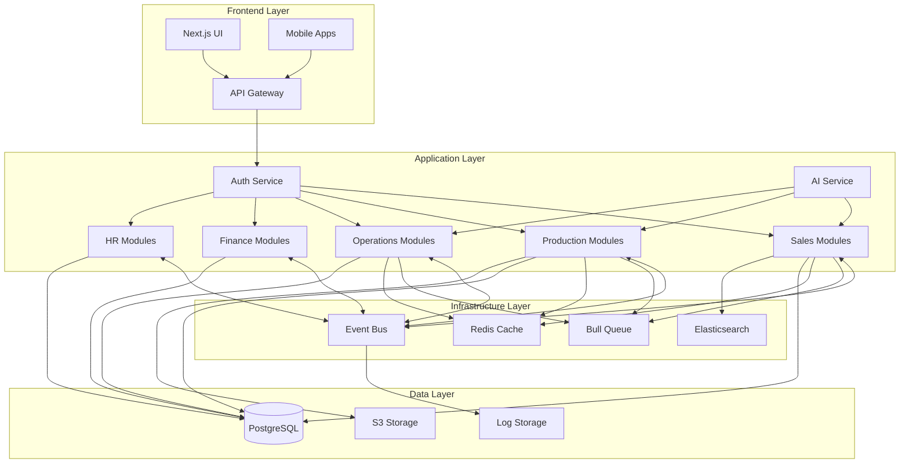

# 🔌 Integrations - Полная карта взаимодействий модулей

## 📌 Обзор интеграций

Prometric ERP построен на принципах модульной архитектуры с глубокой интеграцией между всеми компонентами. Каждый модуль может работать независимо, но максимальная эффективность достигается через orchestrated взаимодействия.

## 🏗️ Архитектура интеграций



## 🔄 Core Integration Patterns

### 1. Event-Driven Architecture

```typescript
// EventEmitter2 Configuration
@Module({
  imports: [
    EventEmitterModule.forRoot({
      wildcard: true,
      delimiter: '.',
      maxListeners: 20,
      verboseMemoryLeak: true,
      ignoreErrors: false,
    }),
  ],
})
export class AppModule {}

// Event Naming Convention
const events = {
  // Module.Entity.Action
  'deal.won': DealWonEvent,
  'order.created': OrderCreatedEvent,
  'production.order.completed': ProductionOrderCompletedEvent,
  'inventory.stock.low': InventoryStockLowEvent,
  'payment.received': PaymentReceivedEvent,
  'employee.onboarded': EmployeeOnboardedEvent,
};
```

### 2. Service-to-Service Communication

```typescript
// Dependency Injection Pattern
@Injectable()
export class DealsService {
  constructor(
    // Direct service dependencies
    private readonly customersService: CustomersService,
    private readonly productsService: ProductsService,
    private readonly ordersService: OrdersService,
    private readonly invoicesService: InvoicesService,
    // Event emitter for async communication
    private readonly eventEmitter: EventEmitter2,
    // Queue for background jobs
    private readonly dealQueue: Queue,
  ) {}
}
```

### 3. Database Relationships

```typescript
// Cross-module entity relationships
@Entity('deals')
export class Deal {
  @ManyToOne(() => Customer, { lazy: true })
  customer: Promise<Customer>;
  
  @OneToMany(() => Order, order => order.deal, { lazy: true })
  orders: Promise<Order[]>;
  
  @OneToMany(() => Invoice, invoice => invoice.deal, { lazy: true })
  invoices: Promise<Invoice[]>;
  
  @OneToMany(() => Task, task => task.deal, { lazy: true })
  tasks: Promise<Task[]>;
}
```

## 🎯 Major Integration Flows

### 1. Sales → Production Integration

#### Deal Won → Production Order Flow

```typescript
// Step 1: Deal Won Event
@Injectable()
export class DealWonOrchestrator {
  @OnEvent('deal.won')
  async handleDealWon(event: DealWonEvent) {
    const { dealId, workspaceId, organizationId } = event;
    
    // 1. Create Order from Deal
    const order = await this.ordersService.createFromDeal({
      dealId,
      workspaceId,
      organizationId,
      status: 'pending',
    });
    
    // 2. Check inventory for products
    const inventoryCheck = await this.checkInventory(order.items);
    
    // 3. Create Production Orders for unavailable items
    for (const item of inventoryCheck.unavailable) {
      await this.productionService.createProductionOrder({
        orderId: order.id,
        productId: item.productId,
        quantity: item.quantity,
        dueDate: order.deliveryDate,
        priority: this.calculatePriority(order),
      });
    }
    
    // 4. Create Invoice
    const invoice = await this.invoicesService.createFromOrder({
      orderId: order.id,
      dueDate: this.calculateDueDate(order),
      terms: order.customer.paymentTerms,
    });
    
    // 5. Emit order.created event
    this.eventEmitter.emit('order.created', {
      orderId: order.id,
      hasProductionOrders: inventoryCheck.unavailable.length > 0,
    });
  }
}
```

#### Order Fulfillment → Warehouse Integration

```typescript
@Injectable()
export class OrderFulfillmentOrchestrator {
  @OnEvent('order.created')
  async handleOrderCreated(event: OrderCreatedEvent) {
    const { orderId, hasProductionOrders } = event;
    
    if (!hasProductionOrders) {
      // Direct fulfillment from warehouse
      await this.createPickingOrder(orderId);
      await this.reserveInventory(orderId);
      await this.createPackingOrder(orderId);
      await this.createShippingOrder(orderId);
    } else {
      // Wait for production completion
      await this.orderQueue.add('wait-for-production', {
        orderId,
        checkInterval: 3600000, // 1 hour
      });
    }
  }
  
  @OnEvent('production.order.completed')
  async handleProductionCompleted(event: ProductionCompletedEvent) {
    const { productionOrderId, orderId } = event;
    
    // Check if all production orders for this order are complete
    const allComplete = await this.checkAllProductionComplete(orderId);
    
    if (allComplete) {
      // Move to fulfillment
      this.eventEmitter.emit('order.ready.for.fulfillment', { orderId });
    }
  }
}
```

### 2. Production → Operations Integration

#### Production Planning → Procurement

```typescript
@Injectable()
export class ProductionPlanningService {
  async createProductionPlan(orderId: string) {
    const order = await this.ordersService.findOne(orderId);
    
    // 1. Get BOM for each product
    const bomRequirements = await Promise.all(
      order.items.map(item => 
        this.bomService.calculateRequirements(item.productId, item.quantity)
      )
    );
    
    // 2. Check material availability
    const materialCheck = await this.inventoryService.checkMaterials(
      bomRequirements.flat()
    );
    
    // 3. Create Purchase Requisitions for missing materials
    for (const missing of materialCheck.missing) {
      await this.procurementService.createRequisition({
        materialId: missing.materialId,
        quantity: missing.quantity,
        requiredBy: order.deliveryDate,
        priority: 'high',
        requestedBy: 'production-planning',
        orderId: orderId,
      });
    }
    
    // 4. Schedule production when materials available
    if (materialCheck.allAvailable) {
      await this.scheduleProduction(orderId);
    } else {
      // Wait for procurement
      this.eventEmitter.emit('production.waiting.materials', {
        orderId,
        missingMaterials: materialCheck.missing,
      });
    }
  }
}
```

#### Quality Control → Order Completion

```typescript
@Injectable()
export class QualityControlService {
  @OnEvent('production.batch.completed')
  async handleBatchCompleted(event: BatchCompletedEvent) {
    const { batchId, productionOrderId } = event;
    
    // 1. Create quality inspection
    const inspection = await this.createInspection({
      batchId,
      type: 'production-output',
      checkpoints: await this.getProductCheckpoints(batchId),
    });
    
    // 2. Perform automated checks
    const autoResults = await this.performAutomatedChecks(inspection);
    
    // 3. If passed, update inventory
    if (autoResults.passed) {
      await this.inventoryService.addStock({
        productId: inspection.productId,
        quantity: inspection.quantity,
        batchId: batchId,
        quality: 'passed',
      });
      
      // 4. Update production order
      await this.productionService.updateOrderStatus(
        productionOrderId,
        'completed'
      );
      
      // 5. Notify order fulfillment
      this.eventEmitter.emit('production.order.completed', {
        productionOrderId,
        orderId: inspection.orderId,
      });
    } else {
      // Handle quality failure
      await this.handleQualityFailure(inspection, autoResults);
    }
  }
}
```

### 3. Finance → Sales Integration

#### Invoice → Customer Balance

```typescript
@Injectable()
export class PaymentProcessingService {
  @OnEvent('payment.received')
  async handlePaymentReceived(event: PaymentReceivedEvent) {
    const { paymentId, invoiceId, amount } = event;
    
    // 1. Update invoice status
    const invoice = await this.invoicesService.updatePaymentStatus(
      invoiceId,
      amount
    );
    
    // 2. Update customer balance
    await this.customersService.updateBalance(
      invoice.customerId,
      -amount
    );
    
    // 3. Check if fully paid
    if (invoice.status === 'paid') {
      // Update order status
      await this.ordersService.updatePaymentStatus(
        invoice.orderId,
        'paid'
      );
      
      // Update customer metrics
      await this.customersService.updateMetrics(invoice.customerId, {
        lastPaymentDate: new Date(),
        totalPaidAmount: amount,
        paymentBehavior: 'on-time',
      });
      
      // Check credit limit
      await this.checkAndUpdateCreditLimit(invoice.customerId);
    }
    
    // 4. Generate receipt
    await this.documentsService.generateReceipt({
      paymentId,
      invoiceId,
      template: 'payment-receipt',
    });
  }
}
```

### 4. HR → Operations Integration

#### Employee → Task Assignment

```typescript
@Injectable()
export class TaskAssignmentService {
  async assignTask(taskData: CreateTaskDto) {
    // 1. Find available employees
    const availableEmployees = await this.employeesService.findAvailable({
      departmentId: taskData.departmentId,
      skills: taskData.requiredSkills,
      workload: { $lt: 80 }, // Less than 80% workload
    });
    
    // 2. Calculate best match
    const bestMatch = this.calculateBestMatch(
      availableEmployees,
      taskData
    );
    
    // 3. Create task assignment
    const task = await this.tasksService.create({
      ...taskData,
      assignedTo: bestMatch.employeeId,
      estimatedHours: this.estimateHours(taskData, bestMatch),
    });
    
    // 4. Update employee workload
    await this.employeesService.updateWorkload(
      bestMatch.employeeId,
      task.estimatedHours
    );
    
    // 5. Send notification
    await this.notificationService.send({
      to: bestMatch.employeeId,
      type: 'task-assigned',
      data: task,
    });
    
    // 6. Update project timeline if needed
    if (taskData.projectId) {
      await this.projectsService.recalculateTimeline(
        taskData.projectId
      );
    }
  }
}
```

### 5. AI Service Integration

#### Sales Prediction Integration

```typescript
@Injectable()
export class SalesPredictionService {
  constructor(
    private readonly aiService: AIService,
    private readonly dealsService: DealsService,
    private readonly customersService: CustomersService,
  ) {}
  
  async predictDealSuccess(dealId: string) {
    const deal = await this.dealsService.findOne(dealId, {
      relations: ['customer', 'products', 'activities'],
    });
    
    const customer = await this.customersService.findOne(
      deal.customerId,
      { relations: ['orders', 'payments'] }
    );
    
    // Prepare context for AI
    const context = {
      deal: {
        value: deal.value,
        stage: deal.stage,
        daysInPipeline: this.calculateDaysInPipeline(deal),
        activitiesCount: deal.activities.length,
        lastActivityDays: this.daysSinceLastActivity(deal),
      },
      customer: {
        type: customer.type,
        totalOrders: customer.orders.length,
        totalRevenue: customer.lifetimeValue,
        paymentBehavior: customer.paymentBehavior,
        relationshipLength: this.calculateRelationshipLength(customer),
      },
      historical: await this.getHistoricalData(deal),
    };
    
    // Get AI prediction
    const prediction = await this.aiService.predict({
      model: 'deal-success-predictor',
      context,
      action: 'predict-close-probability',
    });
    
    // Update deal with prediction
    await this.dealsService.update(dealId, {
      aiPredictedProbability: prediction.probability,
      aiRecommendedActions: prediction.recommendations,
      aiRiskFactors: prediction.risks,
    });
    
    return prediction;
  }
}
```

## 🔐 Security Integration

### Multi-tenancy Enforcement

```typescript
// Global interceptor for all requests
@Injectable()
export class WorkspaceInterceptor implements NestInterceptor {
  intercept(context: ExecutionContext, next: CallHandler) {
    const request = context.switchToHttp().getRequest();
    const user = request.user;
    
    // Inject workspace context
    request.workspaceContext = {
      organizationId: user.organizationId,
      workspaceId: user.workspaceId,
      userId: user.id,
      role: user.organizationRole,
      permissions: user.permissions,
    };
    
    // Set context for all queries
    return next.handle().pipe(
      tap(() => {
        // Audit log
        this.auditService.log({
          userId: user.id,
          action: request.method,
          resource: request.url,
          workspaceId: user.workspaceId,
        });
      })
    );
  }
}
```

### Permission-based Access

```typescript
// Module-level permissions
@Injectable()
export class PermissionGuard implements CanActivate {
  canActivate(context: ExecutionContext): boolean {
    const request = context.switchToHttp().getRequest();
    const requiredPermissions = Reflect.getMetadata(
      'permissions',
      context.getHandler()
    );
    
    if (!requiredPermissions) return true;
    
    const userPermissions = request.user.permissions;
    
    return requiredPermissions.every(permission =>
      userPermissions.includes(permission)
    );
  }
}

// Usage in controllers
@UseGuards(JwtAuthGuard, PermissionGuard)
@Permissions('DEALS_CREATE', 'DEALS_UPDATE')
@Post()
async create(@Body() dto: CreateDealDto) {
  // ...
}
```

## 🚀 Performance Optimizations

### 1. Lazy Loading Strategy

```typescript
// Entity configuration
@Entity()
export class Order {
  @ManyToOne(() => Customer, { lazy: true })
  customer: Promise<Customer>;
  
  @OneToMany(() => OrderItem, item => item.order, { lazy: true })
  items: Promise<OrderItem[]>;
  
  // Selective loading
  async getWithItems(): Promise<Order> {
    const items = await this.items;
    return { ...this, items };
  }
}
```

### 2. Caching Strategy

```typescript
// Redis caching decorator
@Injectable()
export class CacheService {
  async getCached<T>(
    key: string,
    fallback: () => Promise<T>,
    ttl: number = 300
  ): Promise<T> {
    const cached = await this.redis.get(key);
    if (cached) return JSON.parse(cached);
    
    const result = await fallback();
    await this.redis.setex(key, ttl, JSON.stringify(result));
    return result;
  }
}

// Usage
async getCustomerMetrics(customerId: string) {
  return this.cacheService.getCached(
    `customer:metrics:${customerId}`,
    () => this.calculateMetrics(customerId),
    600 // 10 minutes
  );
}
```

### 3. Batch Processing

```typescript
// Batch queue processor
@Processor('batch-operations')
export class BatchProcessor {
  @Process('bulk-update')
  async handleBulkUpdate(job: Job) {
    const { entities, updates } = job.data;
    
    // Process in chunks
    const chunks = this.chunkArray(entities, 100);
    
    for (const chunk of chunks) {
      await this.dataSource.transaction(async manager => {
        await Promise.all(
          chunk.map(entity =>
            manager.update(entity.type, entity.id, updates)
          )
        );
      });
      
      // Report progress
      await job.progress(
        (chunks.indexOf(chunk) + 1) / chunks.length * 100
      );
    }
  }
}
```

## 📊 Monitoring & Observability

### Event Tracking

```typescript
// Event logger
@Injectable()
export class EventLogger {
  private readonly logger = new Logger('EventLogger');
  
  @OnEvent('**')
  handleAllEvents(event: any) {
    this.logger.log({
      eventName: this.eventEmitter.eventNames(),
      timestamp: new Date(),
      data: event,
    });
    
    // Send to monitoring service
    this.monitoringService.trackEvent({
      name: event.constructor.name,
      properties: event,
    });
  }
}
```

### Performance Metrics

```typescript
// Performance interceptor
@Injectable()
export class PerformanceInterceptor implements NestInterceptor {
  intercept(context: ExecutionContext, next: CallHandler) {
    const start = Date.now();
    const request = context.switchToHttp().getRequest();
    
    return next.handle().pipe(
      tap(() => {
        const duration = Date.now() - start;
        
        // Log slow queries
        if (duration > 1000) {
          this.logger.warn({
            message: 'Slow request detected',
            url: request.url,
            method: request.method,
            duration,
          });
        }
        
        // Send metrics
        this.metricsService.recordLatency(
          request.url,
          duration
        );
      })
    );
  }
}
```

## 🔄 Data Synchronization

### Cross-module Data Consistency

```typescript
// Transaction manager for cross-module operations
@Injectable()
export class TransactionManager {
  async executeInTransaction<T>(
    operations: Array<() => Promise<any>>
  ): Promise<T> {
    return this.dataSource.transaction(async manager => {
      const results = [];
      
      for (const operation of operations) {
        try {
          const result = await operation.call({ manager });
          results.push(result);
        } catch (error) {
          // Rollback all operations
          throw new TransactionFailedException(
            `Transaction failed: ${error.message}`
          );
        }
      }
      
      return results as T;
    });
  }
}

// Usage
async createDealWithOrder(data: DealOrderDto) {
  return this.transactionManager.executeInTransaction([
    () => this.dealsService.create(data.deal),
    () => this.ordersService.create(data.order),
    () => this.invoicesService.create(data.invoice),
  ]);
}
```

### Event Sourcing for Audit

```typescript
// Event store for audit trail
@Injectable()
export class EventStore {
  async append(event: DomainEvent) {
    await this.eventRepository.save({
      aggregateId: event.aggregateId,
      eventType: event.constructor.name,
      eventData: event,
      timestamp: new Date(),
      userId: event.userId,
      workspaceId: event.workspaceId,
    });
  }
  
  async getEvents(aggregateId: string): Promise<DomainEvent[]> {
    return this.eventRepository.find({
      where: { aggregateId },
      order: { timestamp: 'ASC' },
    });
  }
  
  async replay(aggregateId: string): Promise<any> {
    const events = await this.getEvents(aggregateId);
    const aggregate = new Aggregate();
    
    for (const event of events) {
      aggregate.apply(event);
    }
    
    return aggregate;
  }
}
```

## 🎯 Integration Best Practices

### 1. Loose Coupling

```typescript
// Use interfaces for dependencies
interface ICustomerService {
  findOne(id: string): Promise<Customer>;
  updateBalance(id: string, amount: number): Promise<void>;
}

@Injectable()
export class OrderService {
  constructor(
    @Inject('ICustomerService')
    private readonly customerService: ICustomerService
  ) {}
}
```

### 2. Event Contracts

```typescript
// Strongly typed events
export class OrderCreatedEvent {
  constructor(
    public readonly orderId: string,
    public readonly customerId: string,
    public readonly items: OrderItem[],
    public readonly totalAmount: number,
    public readonly workspaceId: string,
    public readonly organizationId: string,
    public readonly userId: string,
    public readonly timestamp: Date = new Date(),
  ) {}
}
```

### 3. Retry Mechanisms

```typescript
// Retry decorator
export function Retry(attempts: number = 3, delay: number = 1000) {
  return function(target: any, propertyKey: string, descriptor: PropertyDescriptor) {
    const originalMethod = descriptor.value;
    
    descriptor.value = async function(...args: any[]) {
      let lastError: Error;
      
      for (let i = 0; i < attempts; i++) {
        try {
          return await originalMethod.apply(this, args);
        } catch (error) {
          lastError = error;
          if (i < attempts - 1) {
            await new Promise(resolve => setTimeout(resolve, delay));
          }
        }
      }
      
      throw lastError;
    };
  };
}

// Usage
@Retry(3, 2000)
async callExternalService(data: any) {
  // ...
}
```

### 4. Circuit Breaker

```typescript
// Circuit breaker implementation
@Injectable()
export class CircuitBreaker {
  private failures = 0;
  private lastFailureTime: Date;
  private state: 'closed' | 'open' | 'half-open' = 'closed';
  
  async execute<T>(
    operation: () => Promise<T>,
    options: CircuitBreakerOptions
  ): Promise<T> {
    if (this.state === 'open') {
      if (this.shouldTryHalfOpen()) {
        this.state = 'half-open';
      } else {
        throw new ServiceUnavailableException('Circuit breaker is open');
      }
    }
    
    try {
      const result = await operation();
      this.onSuccess();
      return result;
    } catch (error) {
      this.onFailure();
      throw error;
    }
  }
  
  private onSuccess() {
    this.failures = 0;
    this.state = 'closed';
  }
  
  private onFailure() {
    this.failures++;
    this.lastFailureTime = new Date();
    
    if (this.failures >= 5) {
      this.state = 'open';
    }
  }
  
  private shouldTryHalfOpen(): boolean {
    const now = new Date();
    const timeSinceLastFailure = 
      now.getTime() - this.lastFailureTime.getTime();
    return timeSinceLastFailure > 60000; // 1 minute
  }
}
```

## 📈 Integration Metrics

### Key Performance Indicators

```typescript
// Integration health metrics
export interface IntegrationMetrics {
  // Latency metrics
  averageLatency: number;
  p95Latency: number;
  p99Latency: number;
  
  // Throughput metrics
  requestsPerSecond: number;
  eventsPerSecond: number;
  
  // Error metrics
  errorRate: number;
  failedIntegrations: number;
  
  // Business metrics
  ordersProcessed: number;
  averageOrderValue: number;
  conversionRate: number;
  fulfillmentTime: number;
}

@Injectable()
export class MetricsCollector {
  async collectIntegrationMetrics(): Promise<IntegrationMetrics> {
    const [latency, throughput, errors, business] = await Promise.all([
      this.collectLatencyMetrics(),
      this.collectThroughputMetrics(),
      this.collectErrorMetrics(),
      this.collectBusinessMetrics(),
    ]);
    
    return {
      ...latency,
      ...throughput,
      ...errors,
      ...business,
    };
  }
}
```

## 🔧 Troubleshooting Common Integration Issues

### 1. Event Loop Detection

```typescript
// Prevent infinite event loops
@Injectable()
export class EventLoopDetector {
  private eventChain = new Map<string, number>();
  
  @OnEvent('**')
  detectLoop(event: any) {
    const key = `${event.constructor.name}:${event.aggregateId}`;
    const count = (this.eventChain.get(key) || 0) + 1;
    
    if (count > 10) {
      this.logger.error(`Event loop detected for ${key}`);
      throw new Error('Event loop detected');
    }
    
    this.eventChain.set(key, count);
    
    // Clear after processing
    setTimeout(() => this.eventChain.delete(key), 5000);
  }
}
```

### 2. Dead Letter Queue

```typescript
// Handle failed messages
@Processor('failed-jobs')
export class DeadLetterProcessor {
  @Process('retry-failed')
  async retryFailed(job: Job) {
    const { originalJob, attempts } = job.data;
    
    if (attempts >= 3) {
      // Move to permanent failure storage
      await this.failureStorage.store({
        job: originalJob,
        reason: 'Max retries exceeded',
        timestamp: new Date(),
      });
      
      // Notify administrators
      await this.notificationService.notifyAdmins({
        type: 'job-permanently-failed',
        job: originalJob,
      });
    } else {
      // Retry with exponential backoff
      await this.queue.add(originalJob.name, originalJob.data, {
        delay: Math.pow(2, attempts) * 1000,
        attempts: attempts + 1,
      });
    }
  }
}
```

## 🚀 Future Integration Plans

### 1. Microservices Migration Path

```yaml
# Future architecture
services:
  - name: sales-service
    language: nodejs
    framework: nestjs
    database: postgresql
    
  - name: production-service
    language: nodejs
    framework: nestjs
    database: postgresql
    
  - name: finance-service
    language: nodejs
    framework: nestjs
    database: postgresql
    
  - name: ai-service
    language: python
    framework: fastapi
    ml-framework: tensorflow
    
communication:
  - type: grpc
    services: [sales-service, production-service]
  - type: rest
    services: [all]
  - type: event-bus
    broker: kafka
```

### 2. External Integrations Roadmap

```typescript
// Planned external integrations
const futureIntegrations = {
  // Logistics providers
  logistics: [
    'DHL API',
    'Kazpost API',
    'Yandex.Delivery',
  ],
  
  // Payment systems (internal only, no banks)
  payments: [
    'Internal Payment Gateway',
    'Corporate Card System',
    'Expense Management',
  ],
  
  // Communication
  communication: [
    'SMS Gateway (Kazakh providers)',
    'WhatsApp Business API',
    'Telegram Bot API',
  ],
  
  // Analytics
  analytics: [
    'Custom BI Dashboard',
    'Real-time Analytics Engine',
    'Predictive Analytics ML',
  ],
  
  // Government services
  government: [
    'ЭСФ (Electronic Invoice)',
    'Egov.kz Integration',
    'Tax Reporting API',
  ],
};
```

## 📚 Integration Documentation Index

### Module-Specific Integrations
- [Sales-Production Integration](./sales-production.md)
- [Production-Operations Integration](./production-operations.md)
- [Finance-Sales Integration](./finance-sales.md)
- [HR-Operations Integration](./hr-operations.md)
- [AI Service Integration](./ai-integration.md)

### Technical Integrations
- [Event System](./event-system.md)
- [Queue Processing](./queue-processing.md)
- [Cache Strategy](./cache-strategy.md)
- [Search Integration](./search-integration.md)

### External Integrations
- [API Gateway](./api-gateway.md)
- [Authentication](./authentication.md)
- [File Storage](./file-storage.md)
- [Monitoring](./monitoring.md)

---

© 2025 Prometric ERP. Integration Documentation.