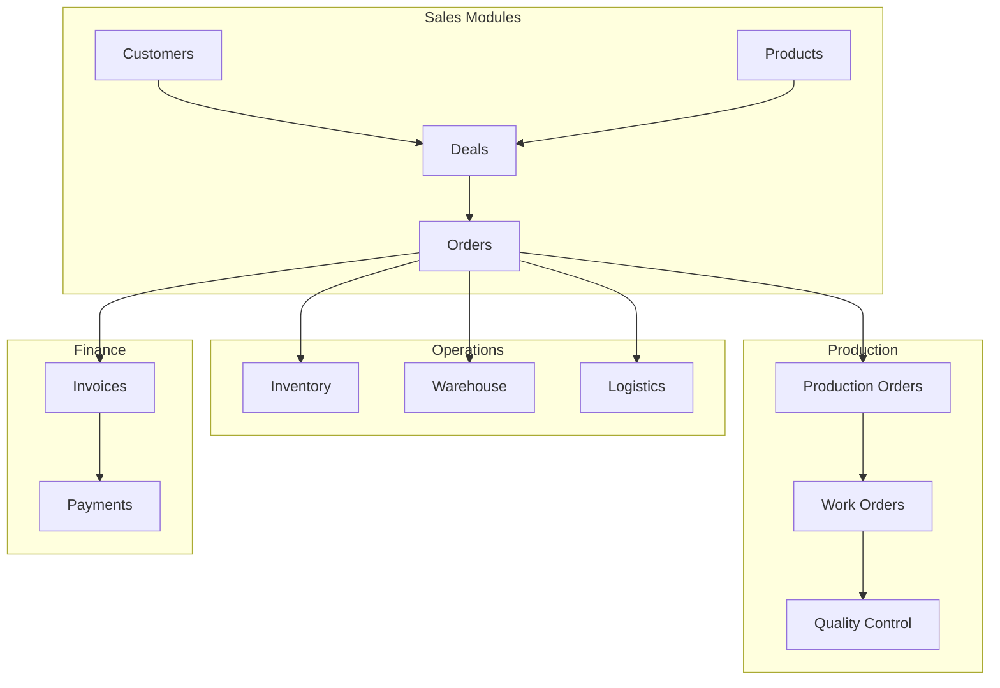

# 🛍️ Sales Modules - Обзор и взаимосвязи

## 📌 Общее описание

Sales Modules - комплексная система управления продажами в Prometric ERP, включающая 4 основных модуля:

1. **Products Module** - Управление товарами и услугами
2. **Customers Module** - CRM и управление клиентами  
3. **Deals Module** - Управление сделками и воронкой продаж
4. **Orders Module** - Обработка и выполнение заказов

## 🔄 Архитектура взаимодействия



## 🎯 Основной бизнес-процесс

### 1. Lead Generation → Customer Creation
```typescript
// Создание лида
Customer (status: LEAD) → Marketing Activities → Qualification
```

### 2. Deal Pipeline
```typescript
// Воронка продаж
LEAD → QUALIFIED → PROPOSAL → NEGOTIATION → CLOSING → WON/LOST
```

### 3. Order Fulfillment (При WON)
```typescript
// Автоматическая оркестрация
Deal.WON → DealWonOrchestrator → {
  1. Create Order
  2. Create Invoice
  3. Check Inventory → {
      If Available: Create PickingOrder
      If Not: Create ProductionOrder
  }
  4. Create DeliveryOrder
  5. Update Customer Status → ACTIVE
}
```

## 📊 Ключевые сущности и связи

### Products ↔ Deals
- **DealProduct** - M:N связь через промежуточную таблицу
- Калькуляция цен с учетом скидок и НДС
- Расчет маржи и прибыльности

### Customers ↔ Deals
- **Customer.deals** - One-to-Many (Lazy Loading)
- Автоматическое обновление метрик клиента
- Lifecycle value calculation

### Deals ↔ Orders
- **Deal.orders** - One-to-Many
- Автоматическое создание Order при Deal.WON
- Синхронизация статусов и сумм

### Orders ↔ Production
- **Order → ProductionOrder** - автоматически при отсутствии товара
- Отслеживание статуса производства
- Обновление Order при завершении Production

## 🔌 Event-Driven Architecture

### Основные события

```typescript
// Customer Events
'customer.created'
'customer.status.changed'
'customer.lead.converted'

// Deal Events  
'deal.created'
'deal.stage.changed'
'deal.won' → Triggers orchestration
'deal.lost'

// Order Events
'order.created' → Triggers fulfillment
'order.status.changed'
'order.shipped'
'order.delivered'

// Cross-module Events
'inventory.low' → Affects Orders
'production.completed' → Updates Order
'payment.received' → Updates Customer balance
```

## 🎯 Orchestrators

### DealWonOrchestrator
Обрабатывает выигранные сделки:
1. Создает Order из Deal
2. Создает Invoice
3. Обновляет статус Customer на ACTIVE
4. Эмитирует 'order.created' для fulfillment

### OrderFulfillmentOrchestrator
Управляет выполнением заказов:
1. Проверяет наличие на складе
2. Создает ProductionOrder если нужно производство
3. Создает DeliveryOrder для доставки
4. Координирует все процессы до завершения

## 💾 База данных

### Основные таблицы
- `products` - 30+ полей, поддержка 6 типов продуктов
- `customers` - 40+ полей, B2B/B2C, ИИН/БИН валидация
- `deals` - 35+ полей, pipeline management
- `orders` - 45+ полей, унифицированная система
- `deal_products` - связь сделок и продуктов
- `customer_contacts` - контактные лица
- `customer_addresses` - адреса доставки/юридические
- `deal_activities` - активности по сделкам

### Индексы и оптимизация
- Составные индексы по (organizationId, workspaceId)
- Уникальные индексы для email, ИИН, БИН
- GIN индексы для JSONB полей
- Индексы по foreign keys

## 🔐 Безопасность

### Multi-tenancy
- Изоляция через organizationId + workspaceId
- Row-level security
- Проверка прав на уровне workspace

### Permissions
```typescript
// Products
PRODUCTS_VIEW, PRODUCTS_CREATE, PRODUCTS_UPDATE, PRODUCTS_DELETE

// Customers  
CUSTOMERS_VIEW, CUSTOMERS_CREATE, CUSTOMERS_UPDATE, CUSTOMERS_DELETE

// Deals
DEALS_VIEW, DEALS_CREATE, DEALS_UPDATE, DEALS_DELETE

// Orders
ORDERS_VIEW, ORDERS_CREATE, ORDERS_UPDATE, ORDERS_DELETE, ORDERS_APPROVE
```

## 📈 Аналитика и отчеты

### Sales Analytics
- Pipeline analysis
- Conversion rates
- Win/Loss analysis
- Sales forecasting
- Performance metrics

### Customer Analytics
- RFM analysis
- Lifetime value
- Churn prediction
- Segmentation
- Purchase patterns

### Order Analytics
- Fulfillment metrics
- Delivery performance
- Product popularity
- Revenue analysis
- Profitability reports

## 🚀 Производительность

### Оптимизации
- **Lazy Loading** для связанных данных
- **Redis кеширование** с TTL
- **Batch операции** для массовых действий
- **Elasticsearch** для полнотекстового поиска
- **Queue processing** для тяжелых операций

### Лимиты
- Batch create: до 100 записей
- Query limit: 100 записей по умолчанию
- Cache TTL: 1-10 минут в зависимости от данных
- Transaction timeout: 30 секунд

## 🔄 Интеграции между модулями

### Products → All
- Используется во всех модулях продаж
- Синхронизация цен в реальном времени
- Контроль наличия и резервирование

### Customers → Deals → Orders
- Последовательный flow от лида до заказа
- Автоматическое обновление статусов
- Накопление истории взаимодействий

### Orders → Production/Warehouse/Logistics
- Автоматическое создание связанных заказов
- Отслеживание статусов в реальном времени
- Координация через orchestrators

## 🛠️ Технологический стек

- **Framework:** NestJS 10.x
- **ORM:** TypeORM 0.3.x
- **Database:** PostgreSQL 14
- **Cache:** Redis
- **Queue:** Bull
- **Events:** EventEmitter2
- **Validation:** class-validator
- **Transformation:** class-transformer

## 📝 Важные особенности

### Kazakhstan Localization
- Поддержка ИИН (12 цифр) для физлиц
- Поддержка БИН (12 цифр) для юрлиц
- НДС 12% по умолчанию
- Валюта KZT (тенге)
- Kaspi payment integration ready

### Business Rules
- Автоматическая конверсия LEAD → ACTIVE при первой покупке
- Probability по умолчанию зависит от stage
- Automatic margin calculation
- Credit limit management
- Recurring orders support

## ⚠️ Известные ограничения

1. **Нет интеграции с внешними банками** - все платежи внутри системы
2. **CustomerOrder таблица временно отключена** - используется основная Order
3. **DeliveryOrder требует доработки полей** - временно используются заглушки
4. **Elasticsearch опционален** - можно работать без него

## 🔜 Планы развития

1. Полная интеграция с AI Service для:
   - Прогнозирования продаж
   - Рекомендаций следующих действий
   - Автоматической квалификации лидов
   - Оптимизации цен

2. Расширенная аналитика:
   - Machine Learning для churn prediction
   - Автоматическая сегментация клиентов
   - Predictive lead scoring

3. Улучшения производительности:
   - GraphQL API
   - Микросервисная архитектура
   - Event sourcing для аудита

---

## 📚 Детальная документация

- [Products Module](./products/README.md)
- [Customers Module](./customers/README.md)
- [Deals Module](./deals/README.md)
- [Orders Module](./orders/README.md)

---

© 2025 Prometric ERP. Sales Modules Documentation.